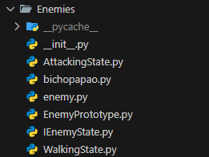
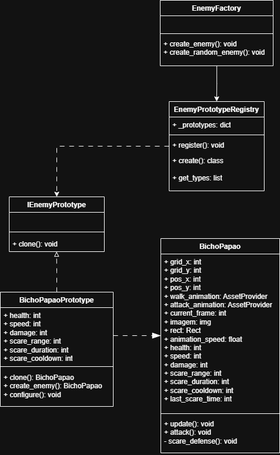

# 3.1. Módulo Padrões de Projeto GoFs Criacionais

## 3.1.1. Introdução

Os **Padrões de Projeto Criacionais**, parte do catálogo da "Gang of Four" (GoF) <a href="#REF1">[1]</a>, representam soluções consagradas para problemas recorrentes relacionados à **criação de objetos** em _software_ orientado a objetos. Diferentemente dos padrões Estruturais e Comportamentais, que lidam com a composição de classes e a comunicação entre objetos, os padrões Criacionais focam em **como instanciar objetos de maneira flexível, independente e reutilizável**.

Esses padrões são essenciais para controlar a complexidade associada à criação de objetos, permitindo **encapsular a lógica de construção**, reduzir dependências diretas e tornar o código mais **adaptável a mudanças**. Eles oferecem formas padronizadas de criar instâncias sem acoplar o código a classes concretas, aumentando a **coesão, a reutilização e a testabilidade** do sistema.

## 3.1.2. Participantes

<font size="3"><p style="text-align: center">Tabela 1: Participantes</p></font>

<div align="center">
<table>
  <thead>
    <tr>
      <th>Nome</th>
      <th>Função</th>
      <th>Data</th>
      <th>Hora</th>
    </tr>
  </thead>
  <tbody>
    <tr>
      <td><a href="https://github.com/caioduart3">Caio Duarte</a></td>
      <td>GoF Criacional - Singleton</td>
      <td>23/10/2025</td>
      <td>20:30</td>
    </tr>
        <tr>
      <td><a href="https://github.com/danielle-soaress">Danielle Soares</a></td>
      <td>GoF Criacional - Prototype</td>
      <td>24/10/2025</td>
      <td>00:00</td>
    </tr>
    <tr>
      <td><a href="https://github.com/EnzoEmir">Enzo Emir</a></td>
      <td>GoF Criacional - Prototype</td>
      <td>24/10/2025</td>
      <td>00:00</td>
    </tr>
    <tr>
      <td><a href="https://github.com/felixlaryssa">Laryssa Félix</a></td>
      <td>GoF Criacional - Singleton</td>
      <td>23/10/2025</td>
      <td>20:30</td>
    </tr>
        <tr>
      <td><a href="https://github.com/Leticia-Arisa-K-Higa">Leticia Arisa</a></td>
      <td>GoF Criacional - Prototype</td>
      <td>24/10/2025</td>
      <td>00:00</td>
    </tr>
        <tr>
      <td><a href="https://github.com/MM4k">Marcelo Makoto</a></td>
      <td>GoF Criacional - Prototype</td>
      <td>24/10/2025</td>
      <td>00:00</td>
    </tr>
        <tr>
      <td><a href="https://github.com/dudaa28">Maria Eduarda</a></td>
      <td>GoF Criacional - Prototype</td>
      <td>24/10/2025</td>
      <td>00:00</td>
    </tr>
    <tr>
      <td><a href="https://github.com/rafaelschadt">Rafael Schadt</a></td>
      <td>GoF Criacional - Singleton</td>
      <td>23/10/2025</td>
      <td>20:30</td>
    </tr>
    <tr>
      <td><a href="https://github.com/VictorPontual">Victor Pontual</a></td>
      <td>GoF Criacional - Singleton</td>
      <td>23/10/2025</td>
      <td>20:30</td>
    </tr>
  </tbody>
</table>
</div>

<font size="2"><p style="text-align: center">Fonte: Equipe do Projeto, 2025.</p></font>

## 3.1.3. Metodologia

A pesquisa e desenvolvimento do estudo dos Padrões de Projeto Criacionais foram conduzidos seguindo uma abordagem prática e colaborativa, com foco na **criação eficiente e flexível de objetos** dentro do sistema de _software_ do jogo.

### 3.1.3.1. Revisão e Seleção de Padrões

Foi realizada uma revisão do catálogo de Padrões de Projeto Criacionais da GoF, selecionando os padrões mais relevantes para **controlar a criação de instâncias de entidades do jogo**, garantindo que o código ficasse mais modular e fácil de estender.

### 3.1.3.2. Aplicação e Implementação

O padrão selecionado (_Singleton_) foi implementado no código-fonte do jogo. Essa etapa visou **reduzir acoplamento direto às classes concretas** e fornecer um mecanismo centralizado de gerenciamento de recursos.

### 3.1.3.3. Modelagem e Documentação UML

Para documentar visualmente a aplicação dos padrões, utilizou-se o **Draw.io** para criar **Diagramas de Classes**.

### 3.1.3.4. Demonstração e Colaboração

Sessões de desenvolvimento e explicação do código foram **registradas via Microsoft Teams**, documentando o processo de aplicação dos padrões e o fluxo colaborativo da equipe.

<div style="text-align: center;">
<iframe width="560" height="315" src="https://www.youtube.com/embed/RtJ-M3CTaQI?si=GBrL8RPyPvW3aRfs" title="YouTube video player" frameborder="0" allow="accelerometer; autoplay; clipboard-write; encrypted-media; gyroscope; picture-in-picture; web-share" referrerpolicy="strict-origin-when-cross-origin" allowfullscreen></iframe>
</div>

<font size="2"><p style="text-align: center">Vídeo 1: Sessão de desenvolvimento e explicação do padrão Singleton.</p></font>

<font size="2"><p style="text-align: center">Fonte: Equipe do Projeto, 2025.</p></font>

## 3.1.4. Singleton

O padrão **Singleton** garante que uma classe tenha **uma única instância** e fornece um ponto global de acesso a ela. No projeto, foi usado para gerenciar recursos globais, como os assets do jogo, garantindo que sejam carregados uma única vez e compartilhados por todo o sistema.

### 3.1.4.1. Diagrama UML

O Singleton foi aplicado no gerenciamento de instâncias dos Assets:

  

<font size="2"><p style="text-align: center">Figura 1: Diagrama de Classes do padrão Singleton aplicado ao AssetProvider.</p></font>

<font size="2"><p style="text-align: center">Fonte: Equipe do Projeto, 2025.</p></font>

O diagrama UML ilustra como a classe `AssetProvider` implementa o padrão Singleton, centralizando o gerenciamento de todos os assets do jogo (imagens, fontes, sprites) e garantindo que esses recursos sejam carregados apenas uma vez durante a execução do programa. A classe utiliza métodos estáticos (`@classmethod`) para controlar o acesso aos recursos e prevenir múltiplas instanciações através do método `__init__` que lança uma exceção.

### 3.1.4.2. Implementação

<details>
  <summary><strong>Código de Implementação do Padrão Singleton</strong></summary>

```python
import pygame
import os
from Template.UIConfigs import *

class AssetProvider:
"""
Singleton para gerenciamento centralizado de assets do jogo.
"""
ASSETS = {}
\_loaded = False

    def __init__(self):
        """Impede instanciação - AssetProvider deve ser usado apenas como classe estática."""
        raise TypeError(
            "AssetProvider não deve ser instanciado. "
            "Use AssetProvider.carregar_assets() e AssetProvider.get(key) diretamente."
        )

    @classmethod
    def carregar_assets(cls):
        """Carrega e escala todos os assets do jogo."""
        if cls._loaded:
            print("[AssetProvider] Assets já carregados anteriormente, pulando recarregamento.")
            return

        base_dir = os.path.dirname(os.path.abspath(__file__))
        try:
            # FONTE
            cls.ASSETS['font_press_start_2P'] = pygame.font.Font(os.path.join(base_dir, 'font', 'PressStart2P-Regular.ttf'), 24)

            # MAP TILES
            cls.ASSETS['grass_claro'] = pygame.transform.scale(
                pygame.image.load(os.path.join(base_dir, 'maps', 'map1', 'titleset', 'grass1.png')).convert_alpha(),
                (TAMANHO_QUADRADO, TAMANHO_QUADRADO)
            )
            cls.ASSETS['grass_escuro'] = pygame.transform.scale(
                pygame.image.load(os.path.join(base_dir, 'maps', 'map1', 'titleset', 'grass2.png')).convert_alpha(),
                (TAMANHO_QUADRADO, TAMANHO_QUADRADO)
            )

            #SCOREBOARD
            cls.ASSETS['scoreboard'] = pygame.transform.scale(
                pygame.image.load(os.path.join(base_dir, 'maps', 'map1', 'object', 'map_scoreboard1.png')).convert_alpha(),
                (TAMANHO_QUADRADO*5, TAMANHO_QUADRADO*1.5)
            )

            cls.ASSETS['scoreboard_slot'] = pygame.transform.scale(
                pygame.image.load(os.path.join(base_dir, 'maps', 'map1', 'object', 'player_block01.png')).convert_alpha(),
                (TAMANHO_QUADRADO/1.8, TAMANHO_QUADRADO/1.6)
            )

            # CAIPORA
            cls.ASSETS['caipora_attack'] = [
                pygame.transform.scale(
                    pygame.image.load(os.path.join(base_dir, 'characters', 'defense', 'caipora', f'caipora_attack{i}.png')).convert_alpha(),
                    (TAMANHO_CAIPORA, TAMANHO_CAIPORA)
                )
                for i in range(1, 3)
            ]

            cls.ASSETS['caipora_projectile'] = pygame.transform.scale(
                pygame.image.load(os.path.join(base_dir, 'characters', 'defense', 'caipora', 'caipora_arrow.png')).convert_alpha(),
                (50, 20)
            )

            # BICHO PAPÃO
            bp_walk = [
                pygame.image.load(os.path.join(base_dir, 'characters', 'enemies', 'bicho-papao', f'bp_walk{i}.png')).convert_alpha()
                for i in range(1, 5)
            ]
            cls.ASSETS['bp_walk'] = [
                pygame.transform.scale(pygame.transform.flip(img, True, False), (TAMANHO_BP, TAMANHO_BP))
                for img in bp_walk
            ]

            bp_attack = [
                pygame.image.load(os.path.join(base_dir, 'characters', 'enemies', 'bicho-papao', f'bp_attack{i}.png')).convert_alpha()
                for i in range(1, 3)
            ]
            cls.ASSETS['bp_attack'] = [
                pygame.transform.scale(pygame.transform.flip(img, True, False), (TAMANHO_BP, TAMANHO_BP))
                for img in bp_attack
            ]

            # GUARANÁ (moeda) - carregar com o mesmo padrão dos outros assets
            cls.ASSETS['guarana_coin'] = pygame.transform.scale(
                pygame.image.load(os.path.join(base_dir, 'maps', 'map1', 'object', 'guarana_coin.png')).convert_alpha(),
                (40, 40)
            )

            # MENU PAUSA
            cls.ASSETS.update({
                # Fundo do menu pausa
                'menu_pausa': pygame.image.load(
                    os.path.join(base_dir, 'menu_pause', 'menu_pausa.png')
                ).convert_alpha(),

                # Botão MÚSICA
                'btn_musica': pygame.transform.scale(
                    pygame.image.load(os.path.join(base_dir, 'menu_pause', 'botao_musica.png')).convert_alpha(),
                    (200, 60)  # Largura, altura
                ),
                'btn_musica_hover': pygame.transform.scale(
                    pygame.image.load(os.path.join(base_dir, 'menu_pause', 'botao_musica_click.png')).convert_alpha(),
                    (200, 60)
                ),

                # Botão EFEITO SONORO
                'btn_efeito': pygame.transform.scale(
                    pygame.image.load(os.path.join(base_dir, 'menu_pause', 'botao_efeitoSonoro.png')).convert_alpha(),
                    (200, 60)
                ),
                'btn_efeito_hover': pygame.transform.scale(
                    pygame.image.load(os.path.join(base_dir, 'menu_pause', 'botao_efeitoSonoro_click.png')).convert_alpha(),
                    (200, 60)
                ),

                # Botão TUTORIAL
                'btn_tutorial': pygame.transform.scale(
                    pygame.image.load(os.path.join(base_dir, 'menu_pause', 'botao_tutorial.png')).convert_alpha(),
                    (200, 60)
                ),
                'btn_tutorial_hover': pygame.transform.scale(
                    pygame.image.load(os.path.join(base_dir, 'menu_pause', 'botao_tutorial_click.png')).convert_alpha(),
                    (200, 60)
                ),

                # Botão Sair da Partida
                'btn_sair': pygame.transform.scale(
                    pygame.image.load(os.path.join(base_dir, 'menu_pause', 'botao_sair_partida.png')).convert_alpha(),
                    (200, 60)
                ),
                'btn_sair_hover': pygame.transform.scale(
                    pygame.image.load(os.path.join(base_dir, 'menu_pause', 'botao_sair_partida_click.png')).convert_alpha(),
                    (200, 60)
                ),

                # Icone Som Normal
                'icon_som': pygame.transform.scale(
                    pygame.image.load(os.path.join(base_dir, 'menu_pause', 'icone_som_normal.png')).convert_alpha(),
                    (40, 40)
                ),
                'icon_som_hover': pygame.transform.scale(
                    pygame.image.load(os.path.join(base_dir, 'menu_pause', 'icone_som_click.png')).convert_alpha(),
                    (40, 40)
                ),

                # Icone Som Mudo
                'icon_mute': pygame.transform.scale(
                    pygame.image.load(os.path.join(base_dir, 'menu_pause', 'icone_som_mute.png')).convert_alpha(),
                    (40, 40)
                ),

                # Barra de volume
                'barra_volume_mute': pygame.transform.scale(
                    pygame.image.load(os.path.join(base_dir, 'menu_pause', 'barra_0.png')).convert_alpha(),
                    (150, 20)
                ),
                'barra_volume_mute_houver': pygame.transform.scale(
                    pygame.image.load(os.path.join(base_dir, 'menu_pause', 'barra_0_click.png')).convert_alpha(),
                    (150, 20)
                ),
                'barra_volume_25': pygame.transform.scale(
                    pygame.image.load(os.path.join(base_dir, 'menu_pause', 'barra_25.png')).convert_alpha(),
                    (150, 20)
                ),
                'barra_volume_25_houver': pygame.transform.scale(
                    pygame.image.load(os.path.join(base_dir, 'menu_pause', 'barra_25_click.png')).convert_alpha(),
                    (150, 20)
                ),
                'barra_volume_50': pygame.transform.scale(
                    pygame.image.load(os.path.join(base_dir, 'menu_pause', 'barra_50.png')).convert_alpha(),
                    (150, 20)
                ),
                'barra_volume_50_houver': pygame.transform.scale(
                    pygame.image.load(os.path.join(base_dir, 'menu_pause', 'barra_50_click.png')).convert_alpha(),
                    (150, 20)
                ),
                'barra_volume_75': pygame.transform.scale(
                    pygame.image.load(os.path.join(base_dir, 'menu_pause', 'barra_75.png')).convert_alpha(),
                    (150, 20)
                ),
                'barra_volume_75_houver': pygame.transform.scale(
                    pygame.image.load(os.path.join(base_dir, 'menu_pause', 'barra_75_click.png')).convert_alpha(),
                    (150, 20)
                ),
                'barra_volume_100': pygame.transform.scale(
                    pygame.image.load(os.path.join(base_dir, 'menu_pause', 'barra_100.png')).convert_alpha(),
                    (150, 20)
                ),
                'barra_volume_100_houver': pygame.transform.scale(
                    pygame.image.load(os.path.join(base_dir, 'menu_pause', 'barra_100_click.png')).convert_alpha(),
                    (150, 20)
                ),

                # MENU CONFIGURAÇÕES
                'menu_config': pygame.image.load(
                    os.path.join(base_dir, 'menu_config', 'menu_config.png')
                ).convert_alpha(),
                'btn_voltar': pygame.transform.scale(
                    pygame.image.load(os.path.join(base_dir, 'menu_config', 'botao_voltar.png')).convert_alpha(),
                    (200, 60)
                ),
                'btn_voltar_hover': pygame.transform.scale(
                    pygame.image.load(os.path.join(base_dir, 'menu_config', 'botao_voltar_click.png')).convert_alpha(),
                    (200, 60)
                ),
                'btn_salvar': pygame.transform.scale(
                    pygame.image.load(os.path.join(base_dir, 'menu_config', 'botao_salvar.png')).convert_alpha(),
                    (200, 60)
                ),
                'btn_salvar_hover': pygame.transform.scale(
                    pygame.image.load(os.path.join(base_dir, 'menu_config', 'botao_salvar_click.png')).convert_alpha(),
                    (200, 60)
                ),

                # MENU PRINCIPAL
                'menu_principal': pygame.image.load(
                    os.path.join(base_dir, 'menu', 'menu_screen', 'main_screen.png')
                ).convert_alpha(),

                # Botões do Menu Principal
                'menu_btn_jogar': pygame.image.load(
                    os.path.join(base_dir, 'menu', 'menu_screen', 'main_screen_button3.png')
                ).convert_alpha(),
                'menu_btn_jogar_hover': pygame.image.load(
                    os.path.join(base_dir, 'menu', 'menu_screen', 'main_screen_button_click1.png')
                ).convert_alpha(),

                'menu_btn_loja': pygame.image.load(
                    os.path.join(base_dir, 'menu', 'menu_screen', 'main_screen_button2.png')
                ).convert_alpha(),
                'menu_btn_loja_hover': pygame.image.load(
                    os.path.join(base_dir, 'menu', 'menu_screen', 'main_screen_button_click2.png')
                ).convert_alpha(),

                'menu_btn_creditos': pygame.image.load(
                    os.path.join(base_dir, 'menu', 'menu_screen', 'main_screen_button1.png')
                ).convert_alpha(),
                'menu_btn_creditos_hover': pygame.image.load(
                    os.path.join(base_dir, 'menu', 'menu_screen', 'main_screen_button_click3.png')
                ).convert_alpha(),

                'menu_btn_config': pygame.image.load(
                    os.path.join(base_dir, 'menu', 'menu_screen', 'botao_config.png')
                ).convert_alpha(),
                'menu_btn_config_hover': pygame.image.load(
                    os.path.join(base_dir, 'menu', 'menu_screen', 'botao_config_click.png')
                ).convert_alpha(),
                })

            cls._loaded = True
            print("[AssetProvider] Assets carregados com sucesso.")

        except pygame.error as e:
            print(f"[AssetProvider] ERRO CRÍTICO ao carregar assets: {e}")
            pygame.quit()
            exit()

    @classmethod
    def is_loaded(cls) -> bool:
        """Verifica se os assets já foram carregados."""
        return cls._loaded

    @classmethod
    def reload(cls):
        """Força recarregamento de todos os assets (use com cautela)."""
        cls._loaded = False
        cls.ASSETS.clear()
        cls.carregar_assets()

    @classmethod
    def get(cls, key):
        """Método helper para acessar um asset."""
        return cls.ASSETS.get(key)
```

</details>

### 3.1.4.3. Opiniões dos Participantes

<details>
  <summary><strong><a href="https://github.com/caioduart3">Caio Duarte</a></strong></summary>
  <p>Achei um padrão simples, útil para muitos projetos e contextos e fácil de implementar. Acredito que ele se encaixou perfeitamente com o nosso contexto de assets.</p>
</details>

<details>
  <summary><strong><a href="https://github.com/felixlaryssa">Laryssa Félix</a></strong></summary>
  <p>  Percebi que o padrão Singleton é muito útil em situações em que precisamos garantir que apenas uma instância de uma classe exista em todo o sistema, como no caso de gerenciamento de configurações, logs ou assets de um jogo. Ele traz praticidade e evita desperdício de recursos, já que centraliza o acesso a um único objeto. Porém, considero importante usá-lo com cuidado se for aplicado de forma excessiva, pode acabar dificultando testes e aumentar o acoplamento do código. Por isso, acredito que o Singleton deve ser usado apenas quando realmente faz sentido garantir uma única instância, como no caso de provedores de recursos ou conexões globais.</p>
</details>

<details>
  <summary><strong><a href="https://github.com/rafaelSchadt">Rafael Welz Schadt</a></strong></summary>
  <p>Achei o Singleton simples, porém muito útil. É aplicável a quase todo o contexto do projeto, e ajuda muito em projetos de pequeno porte.</p>
</details>

<details>
  <summary><strong><a href="https://github.com/VictorPontual">Victor Pontual Guedes Nobrega</a></strong></summary>
  <p>Gostei do padrão Singleton porque separa a lógica de criação da lógica de uso, deixando o código mais limpo e organizado. No contexto do jogo, ele foi essencial para garantir que os assets sejam carregados uma única vez e compartilhados por todo o sistema, evitando duplicação de memória e facilitando o acesso global aos recursos de forma segura e intuitiva através dos métodos de classe.</p>
</details>

## 3.1.5. Prototype

O padrão Prototype é um padrão de projeto criacional que tem como objetivo criar novos objetos a partir da cópia (clone) de instâncias existentes, em vez de criar novos objetos do zero.

A intenção principal é evitar o custo de criar objetos complexos diretamente e fornecer um mecanismo flexível de duplicação, permitindo que o sistema copie objetos existentes (incluindo suas configurações internas) sem depender de suas classes concretas.

### 3.1.5.1. Diagrama UML

O GoF Criacional Prototype foi aplicado ao projeto, no seguinte código:




???+ note "Aplicação do Padrão Prototype (Sistema de Criação de Inimigos)"
    O trecho de código a seguir, extraído do arquivo principal de gerenciamento de protótipos de inimigos (`EnemyPrototype.py`) demonstra a implementação do Padrão Prototype através das classes `IEnemyPrototype`, `EnemyPrototypeRegistry` e `BichoPapaoPrototype`.
    
    Essa implementação permite criar novas instâncias de inimigos através da clonagem de protótipos pré-configurados, ao invés de instanciar diretamente as classes, proporcionando flexibilidade na criação e configuração de diferentes tipos de inimigos.

    ```python
    from abc import ABC, abstractmethod
    from typing import Dict, Optional

    class IEnemyPrototype(ABC):
        """Interface Prototype seguindo o padrão GOF"""
        
        @abstractmethod
        def clone(self):
            """Clona o prototype atual retornando uma nova instância"""
            pass

    class EnemyPrototypeRegistry:
        """Registry que mantém instâncias dos prototypes para clonagem"""
        
        _prototypes: Dict[str, IEnemyPrototype] = {}
        
        @classmethod
        def register(cls, enemy_type: str, prototype: IEnemyPrototype):
            """Registra um prototype no registry"""
            cls._prototypes[enemy_type] = prototype
        
        @classmethod
        def create(cls, enemy_type: str, grid_x: int, grid_y: int, **kwargs):
            """Cria uma nova instância clonando o prototype registrado"""
            if enemy_type in cls._prototypes:
                # Clona o prototype seguindo padrão GOF
                cloned_prototype = cls._prototypes[enemy_type].clone()
                
                # Configura atributos específicos se fornecidos
                if kwargs:
                    cloned_prototype.configure(**kwargs)
                
                # Cria a instância real do inimigo
                if hasattr(cloned_prototype, 'create_enemy'):
                    return cloned_prototype.create_enemy(grid_x, grid_y)
                
            return None

    class EnemyFactory:
        """Factory que utiliza o registry para criar inimigos via protótipos"""
        
        @classmethod
        def create_enemy(cls, enemy_type: str, grid_x: int, grid_y: int, **kwargs):
            return EnemyPrototypeRegistry.create(enemy_type, grid_x, grid_y, **kwargs)
        
        @classmethod
        def create_random_enemy(cls, grid_x: int, grid_y: int):
            import random
            types = EnemyPrototypeRegistry.get_types()
            if types:
                enemy_type = random.choice(types)
                return cls.create_enemy(enemy_type, grid_x, grid_y)
            return None
    ```

???+ note "Implementação do Prototype Concreto (BichoPapao)"
    A classe `BichoPapaoPrototype` implementa a interface `IEnemyPrototype` e demonstra como o padrão Prototype funciona na prática. Ela mantém os atributos configuráveis do inimigo e permite clonagem com diferentes configurações.

    ```python
    class BichoPapaoPrototype(IEnemyPrototype):
        """Concrete Prototype seguindo o padrão GOF"""
        
        def __init__(self, prototype=None):
            """Constructor que pode receber outro prototype para copiar"""
            if prototype is not None:
                # Copia campos do prototype existente
                self.health = prototype.health
                self.speed = prototype.speed
                self.damage = prototype.damage
                self.scare_range = prototype.scare_range
                self.scare_duration = prototype.scare_duration
                self.scare_cooldown = prototype.scare_cooldown
            else:
                # Valores padrão
                self.health = 400
                self.speed = 6
                self.damage = 30
                self.scare_range = 100
                self.scare_duration = 3000
                self.scare_cooldown = 8000
        
        def clone(self):
            """Implementação do clone() seguindo padrão GOF"""
            return BichoPapaoPrototype(self)
        
        def create_enemy(self, grid_x: int, grid_y: int):
            """Cria a instância real do BichoPapao com os atributos do prototype"""
            enemy = BichoPapao(grid_x, grid_y)
            
            # Aplica atributos do prototype
            enemy.health = self.health
            enemy.speed = self.speed
            enemy.damage = self.damage
            enemy.scare_range = self.scare_range
            enemy.scare_duration = self.scare_duration
            enemy.scare_cooldown = self.scare_cooldown
            
            return enemy
        
        def configure(self, **kwargs):
            """Permite configurar atributos específicos"""
            self.health = kwargs.get('health', self.health)
            self.speed = kwargs.get('speed', self.speed)
            self.damage = kwargs.get('damage', self.damage)
    ```

???+ note "Inicialização e Uso do Sistema"
    O sistema é inicializado no `GameMain.py` através da função `initialize_enemy_prototypes()`, que registra os protótipos disponíveis no registry. O uso prático ocorre no `Level.py` onde inimigos são criados através da factory.

    ```python
    # Inicialização dos protótipos (GameMain.py)
    def initialize_enemy_prototypes():
        try:
            from Model.Enemies.bichopapao import BichoPapaoPrototype
            
            EnemyPrototypeRegistry.register("bicho_papao", BichoPapaoPrototype())
            print("[EnemyPrototype] Protótipos inicializados")
            
        except ImportError as e:
            print(f"[EnemyPrototype] ERRO: {e}")

    # Uso prático (Level.py)
    @classmethod
    def inicializar_mapa(cls):
        """Inicializa o mapa lógico e a população inicial."""
        cls.MAPA_LOGICO = [[0] * NUM_COLUNAS for _ in range(NUM_LINHAS)] 
        
        # Criação de inimigo usando o padrão Prototype
        linha_bp = random.randint(0, NUM_LINHAS - 1)
        EnemyFactory.create_enemy("bicho_papao", NUM_COLUNAS - 1, linha_bp)
    ```

Portanto, assim ficou modelado em UML, o padrão Prototype no código do jogo. Clique aqui para [acessar](https://drive.google.com/file/d/1rMZls5VtM-wKu4dU8n61XUSBa_D9p5th/view?usp=sharing)

[](https://app.diagrams.net/#G1rMZls5VtM-wKu4dU8n61XUSBa_D9p5th#%7B%22pageId%22%3A%22x8WGHtwybbcXZKM1W8ie%22%7D)

O diagrama acima ilustra a **arquitetura de classes responsável pela criação de inimigos** no jogo, evidenciando como o **Padrão de Projeto Prototype** foi aplicado para permitir a clonagem e configuração flexível de diferentes tipos de entidades inimigas através de protótipos pré-configurados.

No topo, encontra-se a classe **`EnemyFactory`**, que atua como o **cliente principal** do padrão. Ela possui métodos como `create_enemy()` e `create_random_enemy()`, que **delegam a criação** para o registry de protótipos, mantendo uma interface simples e desacoplada para os consumidores do sistema.

Logo abaixo, a classe **`EnemyPrototypeRegistry`** funciona como o **gerenciador centralizado** de todos os protótipos disponíveis. Ela define funcionalidades essenciais, como:

- `_prototypes`: dicionário que armazena as instâncias dos protótipos registrados.  
- `register()`: método para cadastrar novos tipos de protótipos no sistema.  
- `create()`: método que localiza o protótipo apropriado e executa sua clonagem.  
- `get_types()`: método que retorna os tipos de inimigos disponíveis para criação.

A interface **`IEnemyPrototype`** estabelece o **contrato base** para todos os protótipos, definindo o método `clone()` que deve ser implementado pelas classes concretas. Essa abstração garante que o registry possa trabalhar com qualquer tipo de protótipo sem conhecer suas especificidades.

As classes derivadas de `IEnemyPrototype` representam os **protótipos específicos de cada tipo de inimigo**:

- **`BichoPapaoPrototype`**: implementa a clonagem do BichoPapao, mantendo atributos configuráveis como `health`, `speed`, `damage`, `scare_range`, `scare_duration` e `scare_cooldown`. Possui métodos especializados como `create_enemy()` para gerar a instância final e `configure()` para personalização de atributos.

A classe **`BichoPapao`** representa o **produto final** criado pelo protótipo, sendo uma entidade concreta do jogo que herda de `Enemy`. Ela contém toda a lógica específica do comportamento do Bicho-Papão, incluindo:

- Atributos de posicionamento (`grid_x`, `grid_y`, `pos_x`, `pos_y`)
- Recursos visuais (`walk_animation`, `attack_animation`, `current_frame`)  
- Comportamentos especializados (`update()`, `attack()`, `_scare_defense()`)

Essa organização reflete o uso do **Prototype** aliado à **separação de responsabilidades**:

- O `EnemyFactory` **abstrai** a complexidade de criação para os clientes.  
- O `EnemyPrototypeRegistry` **centraliza** o gerenciamento dos protótipos disponíveis.
- Cada protótipo **encapsula** a lógica de clonagem e configuração de seu tipo específico.
- Os produtos finais **implementam** o comportamento real das entidades no jogo.

Em resumo, o diagrama mostra **uma arquitetura flexível e extensível**, em que o Prototype (`IEnemyPrototype` e suas implementações) permite a criação eficiente de inimigos através de clonagem, enquanto o Registry centraliza o gerenciamento e a Factory oferece uma interface simplificada, favorecendo a **reutilização de configurações** e o **baixo acoplamento** entre os módulos do sistema.

### 3.1.5.2. Opniões dos Participantes

A elaboração desta etapa foi realizada de forma colaborativa em reunião pelo Discord, não gravada, onde os todos membros designados estiveram presentes e participaram ativamente da discussão/elaboração.
O processo da execução do código foi feito no Visual Studio Code e a elaboração da UML foi feita no Draw.io, ferramenta que possibilitou a criação e edição simultânea do diagrama, garantindo integração e alinhamento entre os integrantes.

Ao longo da atividade, cada integrante trouxe ideias e feedbacks que ajudaram a consolidar um resultado alinhado com a visão do grupo como um todo. Esse processo coletivo contribuiu tanto para a consistência do diagrama quanto para o fortalecimento da colaboração na equipe.

<details>
  <summary><strong><a href="https://github.com/danielle-soaress">Danielle Soares</a></strong></summary>
  <p>Achei o Prototype simples de entender e, para mim, foi o padrão mais fácil de identificar no nosso código do jogo, já que o spawn de mobs é um exemplo claro de clonagem de objetos. Nesse sentido, a única dificuldade foi na implementação do código, mas acredito que o trabalho em equipe facilitou bastante essa parte. A elaboração do diagrama UML também foi bem tranquila.</p>
</details>

<details>
  <summary><strong><a href="https://github.com/EnzoEmir">Enzo Emir</a></strong></summary>
  <p>No início, fiquei em dúvida sobre como implementar esse padrão no projeto. No entanto, após conversar com o restante da equipe e discutir possíveis abordagens, a ideia de aplicá-lo nas entidades tornou-se muito mais compreensível.Essa troca de ideias ajudou a visualizar melhor os benefícios do padrão e a forma como ele poderia tornar o código mais organizado e flexível</p>
</details>

<details>
  <summary><strong><a href="https://github.com/Leticia-Arisa-K-Higa">Leticia Arisa</a></strong></summary>
  <p>Sobre o Prototype, eu achei bem interessante e fácil de entender. Ele ajuda a criar cópias de objetos de forma prática, sem precisar construir tudo do zero. No nosso projeto, isso ficou claro no spawn de mobs, que usa clonagem de um modelo base. Achei legal ver como esse padrão facilita o código e deixa o desenvolvimento mais rápido.</p>
</details>

<details>
  <summary><strong><a href="https://github.com/MM4K">Marcelo Makoto</a></strong></summary>
  <p>No começo eu fiquei confuso sobre como implementar o padrão Prototype no nosso projeto, mas, quando estudei melhor, foi relativamente simples de implementá-lo. Ele tornou a criação de entidades idênticas muito mais intuitiva e prática, sendo essencial para o futuro do projeto.</p>
</details>

<details>
  <summary><strong><a href="https://github.com/dudaa28">Maria Eduarda Andrade</a></strong></summary>
  <p>Eu acho que o padrão Prototype é bem útil quando precisamos criar cópias de objetos rapidamente, sem ter que recriar tudo do zero. Ele funciona bem em situações como jogos, onde você pode "clonar" um nível e só fazer ajustes pequenos. No começo, pode ser um pouco confuso, igual o que aconteceu com o Iterator, mas depois que a gente entende a ideia de "clonar" objetos, fica muito mais fácil e eficiente de usar.</p>
</details>

### 3.1.5.3. Vídeo Demonstrativo

Foi gravado, na plataforma do Microsoft Teams, uma reunião para a modelagem UML do padrão Prototype e a execução do código além da explicação do mesmo. Clique [aqui](https://www.youtube.com/watch?v=IraLkD6UEac) para acessar.


<iframe width="560" height="315" src="https://www.youtube.com/watch?v=IraLkD6UEac" title="YouTube video player" frameborder="0" allowfullscreen></iframe>


## 3.1.6. Referências Bibliográficas

> <a id="REF1">1.</a> GAMMA, Erich et al. **Padrões de Projeto: Soluções Reutilizáveis de Software Orientado a Objetos**. Tradução de C. F. Lucena e F. S. C. da Silva. Porto Alegre: Bookman, 2007. (Título original: _Design Patterns: Elements of Reusable Object-Oriented Software_).

## 3.1.7. Histórico de Versões 📅

| Versão |    Data    |                Descrição                |                  Autor(es)                   |                    Revisor(es)                     |
| :----: | :--------: | :-------------------------------------: | :------------------------------------------: | :------------------------------------------------: |
| `0.1`  | 23/10/2025 | Adicionando Documentação GoF Criacional | [Caio Duarte](https://github.com/caioduart3), [Laryssa Félix](https://github.com/felixlaryssa) | [Victor Pontual](https://github.com/VictorPontual) |
| `0.2`  | 23/10/2025 | Correção de numeração, formatação do código, adição de vídeo e melhorias na documentação | [Victor Pontual](https://github.com/VictorPontual) | [Maria Eduarda Andrade](https://github.com/dudaa28) |
| `0.3`  | 24/10/2025 | Adicionando Documentação GoF Criacional | [Danielle Soares](https://github.com/danielle-soaress), [Enzo Emir](https://github.com/EnzoEmir), [Leticia Arisa](https://github.com/Leticia-Arisa-K-Higa), [Marcelo Makoto](https://github.com/MM4k), [Maria Eduarda](https://github.com/dudaa28)  | - |
