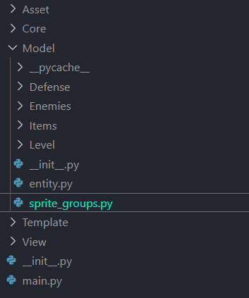
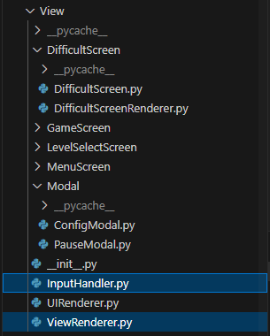
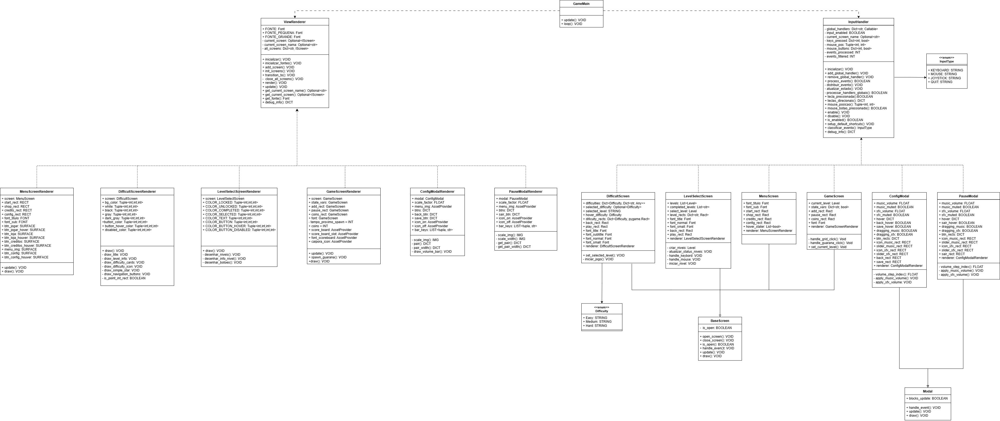
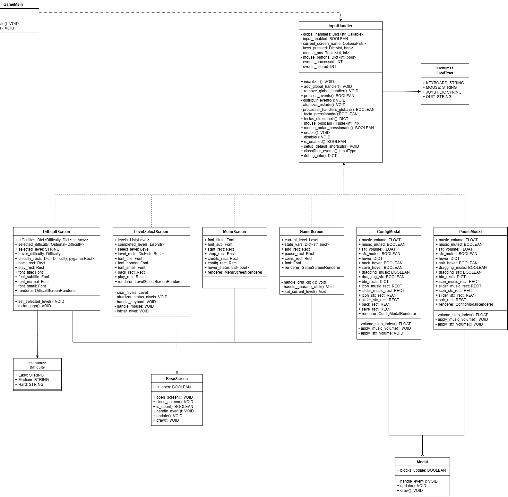
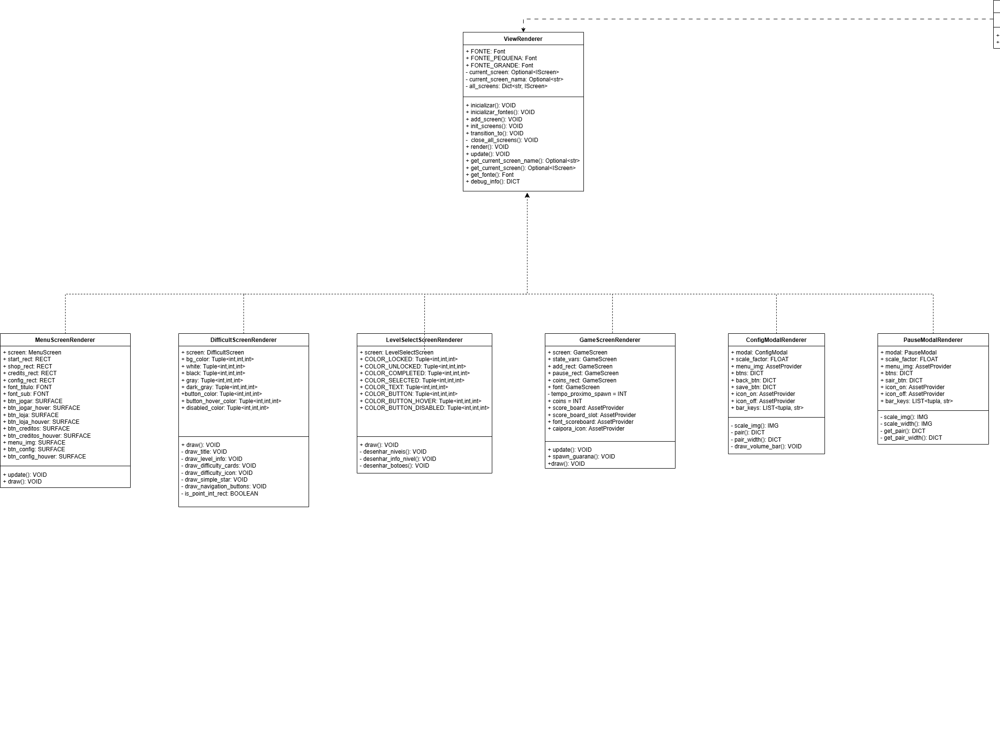

# 3.2. Módulo Padrões de Projeto GoFs Estruturais

## 3.2.1. Introdução

Os padrões de projeto **Estruturais** são focados em como *classes* e *objetos* podem ser compostos para formar estruturas mais complexas e flexíveis dentro de um sistema. O objetivo principal desses padrões é garantir que as relações entre os objetos sejam extensíveis, desacopladas e eficientes, permitindo a criação de sistemas mais robustos e fáceis de modificar. Eles descrevem formas de organizar as classes e objetos em um software, facilitando a construção de estruturas maiores e mais funcionais <a href="#REF1">[1]</a> <a href="#REF2">[2]</a> <a href="#REF3">[3]</a> <a href="#REF4">[4]</a>.

Esses padrões são fundamentais para a criação de interfaces e implementações, especialmente quando se trabalha com herança, e ajudam a estabelecer uma organização eficiente das entidades do sistema. Ao organizar as classes e objetos, eles promovem o desacoplamento, permitindo que mudanças em uma parte do sistema não afetem drasticamente outras partes. Além disso, esses padrões facilitam a comunicação entre as entidades, tornando o código mais flexível, adaptável e mais fácil de entender e manter <a href="#REF5">[5]</a>. 

## Participantes

<font size="3"><p style="text-align: center">Tabela 1: Participantes</p></font>

<div align="center">
<table>
  <thead>
    <tr>
      <th>Nome</th>
      <th>Função</th>
      <th>Data</th>
      <th>Hora</th>
    </tr>
  </thead>
  <tbody>
    <tr>
      <td><a href="https://github.com/caioduart3">Caio Duarte</a></td>
      <td>GoF Estrutural - Composite</td>
      <td>22/10/2025</td>
      <td>20:00</td>
    </tr>
    <tr>
      <td><a href="https://github.com/danielle-soaress">Danielle Soares</a></td>
      <td>GoF Estrutural - Facade</td>
      <td>22/10/2025</td>
      <td>11:00</td>
    </tr>
    <tr>
      <td><a href="https://github.com/EnzoEmir">Enzo Emir</a></td>
      <td>GoF Estrutural - Facade</td>
      <td>22/10/2025</td>
      <td>11:00</td>
    </tr>
    <tr>
      <td><a href="https://github.com/felixlaryssa">Laryssa Félix</a></td>
      <td>GoF Estrutural - Composite</td>
      <td>22/10/2025</td>
      <td>20:00</td>
    </tr>
    <tr>
      <td><a href="https://github.com/Leticia-Arisa-K-Higa">Leticia Arisa</a></td>
      <td>GoF Estrutural - Facade</td>
      <td>22/10/2025</td>
      <td>11:00</td>
    </tr>
    <tr>
      <td><a href="https://github.com/MM4k">Marcelo Makoto</a></td>
      <td>GoF Estrutural - Composite</td>
      <td>22/10/2025</td>
      <td>20:00</td>
    </tr>
    <tr>
      <td><a href="https://github.com/dudaa28">Maria Eduarda</a></td>
      <td>GoF Estrutural - Composite</td>
      <td>22/10/2025</td>
      <td>20:00</td>
    </tr>
    <tr>
      <td><a href="https://github.com/RafaelSchadt">Rafael Welz</a></td>
      <td>GoF Estrutural - Composite</td>
      <td>22/10/2025</td>
      <td>20:00</td>
    </tr>
    <tr>
      <td><a href="https://github.com/VictorPontual">Victor Pontual</a></td>
      <td>GoF Estrutural - Facade</td>
      <td>20/10/2025</td>
      <td>11:00</td>
    </tr>
  </tbody>
</table>
</div>

<font size="2"><p style="text-align: center">Fonte: Equipe do Projeto, 2025.</p></font>

## 3.2.2. Metodologia

A pesquisa e o desenvolvimento do estudo dos Padrões de Projeto Comportamentais foram conduzidos seguindo uma abordagem prática e colaborativa, focada na aplicação real dos conceitos em um sistema de *software* existente.

### 3.2.2.1. Revisão e Seleção de Padrões
Iniciou-se com a revisão do catálogo de Padrões de Projeto Comportamentais da "Gang of Four" (GoF), conforme introduzido na seção anterior. Foram selecionados os padrões mais relevantes para resolver problemas de interação e comunicação observados no **software interno do jogo**, que está hospedado em um repositório de código separado.

### 3.2.2.2. Aplicação e Implementação
Os padrões de projeto selecionados (*Facade* e *Composite*) foram implementados diretamente no código-fonte do *software* interno do jogo. Esta etapa foi crucial para testar a eficácia dos padrões na redução do acoplamento, melhoria da legibilidade e aumento da flexibilidade do sistema.

### 3.2.2.3. Modelagem e Documentação UML
Para documentar visualmente a estrutura e a aplicação dos padrões, o *software* **Draw.io** foi utilizado para a criação de **Diagramas UML (Linguagem de Modelagem Unificada)**. Esses diagramas (principalmente de Classe e/ou Sequência) serviram para mapear as novas interações e relações entre os objetos resultantes da aplicação dos padrões Comportamentais.

### 3.2.2.4. Demonstração e Colaboração
Para garantir a transparência do processo e documentar a participação de cada membro, as sessões de desenvolvimento, discussões técnicas e demonstrações de execução do código foram **gravadas por meio da plataforma Microsoft Teams**. Essas gravações serviram como artefatos de evidência, demonstrando a aplicação prática dos padrões, o fluxo de trabalho colaborativo e a contribuição individual dos membros da equipe na solução dos problemas de design.

## **3.2.3. Composite**

O padrão **Composite** é um padrão de projeto estrutural que visa **compor objetos em estruturas de árvore** para representar hierarquias **"parte-todo"**.

A intenção principal é permitir que os clientes (código que utiliza a estrutura) **tratem objetos individuais e composições de objetos de maneira uniforme**.

### 3.2.3.1. Diagrama UML

O GoF Estrutural *Composite* foi aplicado ao projeto, no seguinte código:



<font size="2"><p style="text-align: center">Fonte: Equipe do Projeto, 2025.</p></font>

???+ note "Aplicação do Padrão Composite (Gerenciamento de Sprites)"
    O trecho de código a seguir, extraído do arquivo principal de gerenciamento de *sprites* (`sprite_groups.py`) demonstra a implementação do Padrão Composite através da classe `SpriteComposite`.  
    Essa classe unifica a gestão de diversos grupos de *sprites* (`caiporas`, `inimigos`, `projeteis`, etc.) permitindo que operações como `update()` e `draw()` sejam executadas de forma transparente em todos os grupos de uma só vez.

    ```python
    import pygame
    from Template.UIConfigs import *

    class SpriteComposite:
        """Gerenciador unificado de todos os grupos de sprites do jogo."""
        def __init__(self):
            self.caiporas = pygame.sprite.Group()
            self.inimigos = pygame.sprite.Group()
            self.projeteis = pygame.sprite.Group()
            self.guaranas = pygame.sprite.Group()

            self._all_groups = [
                self.projeteis,
                self.caiporas,
                self.inimigos,
                self.guaranas
            ]

        def update(self):
            for group in self._all_groups:
                group.update()

        def draw(self, surface):
            for group in self._all_groups:
                group.draw(surface)

        def reset(self):
            for group in self._all_groups:
                group.empty()

    sprite_manager = SpriteComposite()
    ```

Portanto, assim ficou modelado em UML, o padrão Composite no código do jogo. Clique aqui para [acessar](https://app.diagrams.net/#G1p7RkwHkF4gsjF1OD6TZ4vaDRCexq4uEc#%7B"pageId"%3A"C5RBs43oDa-KdzZeNtuy"%7D):

[](https://app.diagrams.net/#G1p7RkwHkF4gsjF1OD6TZ4vaDRCexq4uEc#%7B"pageId"%3A"C5RBs43oDa-KdzZeNtuy"%7D)

<font size="2"><p style="text-align: center">Fonte: Caio Duarte, Laryssa Félix, Marcelo Matoko, Maria Eduarda, Rafael Schadt, 2025.</p></font>

O diagrama acima ilustra a **arquitetura de classes responsável pelo gerenciamento de sprites** no jogo, evidenciando como o **Padrão de Projeto Composite** foi aplicado para unificar e organizar diferentes tipos de entidades (como personagens, inimigos, projéteis e defesas) sob uma mesma estrutura de controle.

No topo, encontra-se a classe **`SpriteComposite`**, que atua como o **componente composto principal**. Ela agrega diversos grupos de sprites — como `caiporas`, `inimigos`, `projeteis` e `guaranas` —, todos representados por instâncias de `pygame.sprite.Group`. Essa classe possui métodos como `update()` e `draw()`, que **propagam as operações** de atualização e renderização para todos os grupos internos, mantendo a hierarquia de forma transparente.

Logo abaixo, a classe **`Entity`** funciona como a **classe base abstrata** para todos os objetos que possuem representação visual e comportamento no jogo. Ela define atributos comuns, como:

- `image`: superfície gráfica da entidade.  
- `rect`: posição e área de colisão.  
- `health`: quantidade de vida da entidade.  
- `update()`: método genérico para atualização, que pode ser sobrescrito pelas subclasses.

As classes derivadas de `Entity` representam os **tipos específicos de entidades do jogo**, sendo elas:

- **`Defesa`**: define estruturas defensivas com atributos de custo, estado atual e comportamento de bloqueio.  
- **`Guarana`**: representa a moeda do jogo, possuindo atributos de velocidade, imagem e método de colisão (`collide()`).  
- **`Arrow`**: modela flechas ou projéteis inimigos, com propriedades de dano e trajetória.  
- **`Enemies`**: classe genérica para inimigos, contendo lógica de movimento, estado e ataque.

Além disso, há classes especializadas que **herdam dessas entidades principais**:

- **`Caipora`**: herda de `Defesa` e adiciona comportamentos específicos, como animações, ataques e controle de tempo de ação.  
- **`BichoPapao`**: herda de `Enemies` e especializa os parâmetros de dano, velocidade e animações de ataque.

Essa organização reflete o uso do **Composite** aliado à **herança hierárquica**:

- O `SpriteComposite` **orquestra** todos os grupos de entidades do jogo.  
- Cada entidade, derivada de `Entity`, **atua como um componente individual** dentro dessa estrutura unificada.

Em resumo, o diagrama mostra **uma hierarquia bem definida e extensível**, em que o Composite (`SpriteComposite`) gerencia múltiplos objetos (entidades e subclasses) como se fossem um único conjunto, favorecendo a coesão e o baixo acoplamento entre os módulos do sistema.

### 3.2.3.2. Opniões dos Participantes

A elaboração desta etapa foi realizada de forma colaborativa em reunião pelo *Discord*, não gravada,  onde os três membros designados estiveram presentes e participaram ativamente da discussão/elaboração.  
O processo da execução do código foi feito no *Visual Studio Code* e a elaboração da UML foi feita no *Draw.io*, ferramenta que possibilitou a criação e edição simultânea do diagrama, garantindo integração e alinhamento entre os integrantes.  

Ao longo da atividade, cada integrante trouxe ideias e feedbacks que ajudaram a consolidar um resultado alinhado com a visão do grupo como um todo. Esse processo coletivo contribuiu tanto para a consistência do diagrama quanto para o fortalecimento da colaboração na equipe.

<details>
  <summary><strong><a href="https://github.com/caioduart3">Caio Duarte</a></strong></summary>
  <p>No início, achei o padrão Composite um pouco confuso de entender, mas com a ajuda dos meus colegas consegui compreender melhor como ele funciona e de que forma poderia ser aplicado ao nosso projeto. No final, percebi que é um padrão muito interessante e útil para organizar a estrutura do código, não só no nosso projeto, mas em praticamente qualquer outro que exija uma hierarquia bem definida entre objetos.</p>
</details>

<details>
  <summary><strong><a href="https://github.com/felixlaryssa">Laryssa Félix</a></strong></summary>
  <p>Assim que comecei a explorar este conteúdo achei um pouco abstrato, mas após ver exemplos práticos que tudo começou a fazer sentido. Percebi que esse padrão é muito útil para organizar as sprites em estruturas hierárquicas, o que deixou nosso código mais limpo e fácil de manter.</p>
</details>

<details>
  <summary><strong><a href="https://github.com/MM4k">Marcelo Matoko</a></strong></summary>
  <p>No começo, eu tive um pouco de dificuldade em entender como o Composite funciona e como implementá-lo no projeto. Porém, ao estudar mais sobre o assunto e pesquisar por exemplos, a implementação do Composite se tornou mais simples e ajudou a estruturar os sprites das entidades de uma forma mais organizada e funcional. Isso ajudou a organizar parte do projeto e deixá-lo mais legível.</p>
</details>

<details>
  <summary><strong><a href="https://github.com/dudaa28">Maria Eduarda Andrade</a></strong></summary>
  <p>Assim como em todo começo, eu me perdi um pouco em como aplicar o Composite dentro da visão do nosso projeto. Depois de algumas discussões e pesquisas com a equipe, percebi que ele seria muito útil para organizar a estrutura do código e dar mais clareza ao que estávamos construindo. No fim, o padrão ajudou a tratar partes do jogo como um todo, deixando a arquitetura mais limpa e alinhada aos princípios do próprio Composite.</p>
</details>

<details>
  <summary><strong><a href="https://github.com/RafaelSchadt">Rafael Schadt</a></strong></summary>
  <p>De fato, no começo, o padrão Composite me pareceu um exagero de abstração. Achei que a complexidade de criar uma interface comum só para forçar o tratamento uniforme de objetos simples e compostos era desnecessária para o nosso caso. Pensei que uma estrutura de classes mais direta já resolveria. Contudo, ao longo da implementação e conforme a hierarquia de objetos do projeto foi crescendo, percebi que essa "complicação" inicial se tornou a nossa maior aliada. Hoje, vejo que é um padrão essencial para manter a escalabilidade e a clareza do código em qualquer projeto que envolva uma estrutura de árvore ou composição, provando que a complexidade inicial valeu a pena pela organização final.</p>
</details>


### 3.2.3.3. Vídeo Demonstrativo

Foi gravado, na plataforma do Microsoft Teams, uma reunião para a modelagem UML do padrão Composite e a execução do código além da explicação do mesmo. Clique [aqui](https://youtu.be/62f51kDLWNQ?si=3HCpRg2Mn46kOYO0) para acessar.

<div align="center">
    <iframe width="560" height="315" src="https://youtube.com/embed/62f51kDLWNQ?si=3HCpRg2Mn46kOYO0" title="YouTube video player" frameborder="0" allowfullscreen></iframe>
</div>

## **3.2.4. Facade**

O padrão Facade (Fachada) é um padrão de projeto estrutural do Gang of Four (GoF) que visa simplificar a interação com sistemas complexos, fornecendo uma interface unificada para um conjunto de classes, bibliotecas ou subsistemas inteiros.

Em vez de o código cliente precisar conhecer e interagir diretamente com as partes internas e detalhadas do sistema, ele se comunica apenas com a fachada, que encapsula e coordena as chamadas para os componentes corretos. Assim, o objetivo principal é esconder a complexidade interna e reduzir o acoplamento entre o cliente e o sistema.

### **3.2.4.1. Estrutura em código**

O GoF Estrutural *Facade* foi aplicado ao projeto, no seguinte código:
<br>




???+ note "Aplicação do Padrão Facade (Gerenciamento de Input e Renderização)"
    Os trechos a seguir, extraídos dos arquivos InputHandler.py e ViewRenderer.py, demonstram a aplicação do Padrão de Projeto Facade no projeto.
    As classes InputHandler e ViewRenderer encapsulam a complexidade dos sistemas de entrada e renderização, oferecendo interfaces simplificadas e unificadas para o restante do jogo.
    Com isso, o código cliente não precisa lidar diretamente com eventos do Pygame nem com a lógica de transição entre telas, mantendo o baixo acoplamento e a alta coesão.

    ```python
    import pygame
    from typing import Callable, Dict, Optional

    class InputHandler:
        """
        Facade responsável por capturar, distribuir e processar eventos de entrada.
        Esconde a complexidade do sistema de input do Pygame.
        """
        _global_handlers: Dict[str, Callable] = {}
        _keys_pressed: Dict[int, bool] = {}
        _mouse_buttons: Dict[int, bool] = {}
        _mouse_pos: tuple = (0, 0)
        _input_enabled = True

        @classmethod
        def inicializar(cls):
            """Inicializa o Facade de Input."""
            cls._global_handlers.clear()
            cls._keys_pressed.clear()
            print("[InputHandler] Facade de Input inicializado")

        @classmethod
        def process_events(cls) -> bool:
            """Interface simplificada para processar todos os eventos."""
            if not cls._input_enabled:
                pygame.event.clear()
                return True

            for event in pygame.event.get():
                if event.type == pygame.QUIT:
                    return False
                cls._atualizar_estado(event)
                if cls._processar_handlers_globais(event):
                    continue
                cls._distribuir_evento(event)
            return True

        @classmethod
        def setup_default_shortcuts(cls):
            """Registra atalhos globais padrão (ex: ESC para menus e pausas)."""
            def handler_esc(event):
                if event.type == pygame.KEYDOWN and event.key == pygame.K_ESCAPE:
                    print("[InputHandler] ESC pressionado — alternando telas ou modais")
                    return True
                return False
            cls._global_handlers["esc"] = handler_esc
    ```

    ```python
    import pygame
    from typing import Dict, Optional
    from View.Interfaces import IScreen

    class ViewRenderer:
        """
        Facade responsável por gerenciar telas, transições e renderização.
        Esconde a complexidade do sistema de telas e recursos gráficos.
        """
        _current_screen: Optional[IScreen] = None
        _current_screen_name: Optional[str] = None
        _all_screens: Dict[str, IScreen] = {}
        FONTE = None

        @classmethod
        def inicializar(cls):
            """Inicializa fontes e prepara o sistema de renderização."""
            cls.FONTE = pygame.font.SysFont('Arial', 30)
            print("[ViewRenderer] Fontes inicializadas")

        @classmethod
        def add_screen(cls, name: str, screen: IScreen):
            """Adiciona uma nova screen ao sistema."""
            cls._all_screens[name] = screen
            print(f"[ViewRenderer] Screen '{name}' registrada")

        @classmethod
        def transition_to(cls, name: str):
            """Gerencia transição entre screens (fecha a atual e abre a nova)."""
            if cls._current_screen:
                cls._current_screen.close_screen()
            cls._current_screen = cls._all_screens.get(name)
            if cls._current_screen:
                cls._current_screen.open_screen()
                cls._current_screen_name = name
                print(f"[ViewRenderer] Transição para '{name}' concluída")

        @classmethod
        def render(cls, surface: pygame.Surface):
            """Renderiza a screen e modais ativos."""
            from Core.ScreenManager import ScreenManager
            if cls._current_screen:
                cls._current_screen.draw(surface)
            for modal in ScreenManager._modals:
                modal.draw(surface)
    ```

Com a utilização dessas fachadas:

- **`InputHandler`**: atua como uma fachada para o subsistema de eventos do Pygame. Ele esconde a complexidade de capturar a fila de eventos, verificar o tipo de cada evento (teclado, mouse), e decidir para qual componente o evento deve ser enviado.

- **`ViewRenderer`**: serve como uma fachada para todo o subsistema de visualização. Em vez de cada parte do código ter que gerenciar diretamente a troca de telas, o carregamento de fontes e a renderização de múltiplas camadas , o ViewRenderer oferece uma interface simples.
  
Assim, sem precisar conhecer a complexidade interna dos subsistemas, o código cliente pode simplesmente chamar:

```python
InputHandler.process_events()
ViewRenderer.transition_to("menu")
```

### **3.2.4.2. Diagrama UML**

Portanto, assim ficou modelado em UML o padrão Facade no código do jogo. Clique aqui para [acessar](https://app.diagrams.net/#G1_oBaHXP7-jTN77sSWRbKSxIPQwD_1cUN):

O Diagrama completo abaixo mostra todas as classes e relações do padrão, permitindo entender a arquitetura global do Facade no jogo. Como o diagrama ficou extenso, logo a seguir terão imagens com zoom em cada fachada (InputHandler e ViewRenderer).

<br>

[](https://app.diagrams.net/#G1_oBaHXP7-jTN77sSWRbKSxIPQwD_1cUN)

<font size="2"><p style="text-align: center">Figura 2: Diagrama UML completo.</p></font>

<br>



<font size="2"><p style="text-align: center">Figura 3: Diagrama com zoom na fachada InputHandler.</p></font>

<br>



<font size="2"><p style="text-align: center">Figura 4: Diagrama com zoom na fachada ViewRenderer.</p></font>

O diagrama acima ilustra a arquitetura de gerenciamento dos subsistemas centrais do jogo, evidenciando como o **Padrão de Projeto Facade** foi aplicado para unificar e simplificar drasticamente a interação com os complexos sistemas de **Entrada** (Input) e **Renderização** (View).

No topo, encontra-se a classe **`GameMain`**, que atua como o cliente principal e orquestrador da arquitetura. Ela contém o *game loop* e orquestra o fluxo do jogo, mas, em vez de lidar diretamente com a complexidade dos eventos do Pygame ou com o gerenciamento de telas, ela delega essas responsabilidades. `GameMain` possui uma relação de Dependência com as duas fachadas, pois ela invoca seus métodos estáticos (`.inicializar()`, `.process_events()`) para controlar o ciclo de vida e a execução delas.

As fachadas são os componentes centrais que definem o padrão:

1.  **`InputHandler` (Fachada de Entrada)**: Atua como um ponto de acesso unificado  para todo o subsistema de eventos.
    * **Responsabilidade**: Encapsula a lógica de capturar a fila de eventos brutos do Pygame, processá-los (`process_events()`), rastrear estados (como `mouse_posicao()`) e classificar eventos.

2.  **`ViewRenderer` (Fachada de Renderização)**: Serve como o ponto de acesso unificado para todo o subsistema de visualização.
    * **Responsabilidade**: Encapsula a complexidade de gerenciar qual tela está ativa, orquestrar transições (`transition_to()`), comandar a renderização (`render()`) e gerenciar recursos gráficos compartilhados (como fontes via `get_fonte()`).

Além do `GameMain`, o diagrama detalha outros clientes que dependem dessas fachadas:

* **Clientes de Renderização**: As classes `MenuScreenRenderer`, `DifficultScreenRenderer`, `LevelSelectionScreenRenderer`, `GameScreenRenderer`, `ConfigModalRenderer` e `PauseModalRenderer` são também clientes do padrão. Elas dependem da fachada `ViewRenderer` para obter acesso a recursos gráficos centralizados, como fontes (`get_fonte()`), e para executar suas lógicas de desenho.

* **Clientes de Entrada**: Notavelmente, o diagrama mostra que as classes `MenuScreen`, `DifficultScreen`, `LevelSelectionScreen`, `GameScreen`, `ConfigModal` e `PauseModal` são também clientes do padrão. Elas dependem da fachada `InputHandler` para simplificar o processamento de eventos, usando métodos como `classificar_evento()` e `mouse_posicao()` para implementar suas lógicas de interação específicas (como cliques em botões).

Essa organização reflete o uso claro do **Facade** para criar pontos de acesso simplificados:

* O `GameMain` (cliente principal) permanece limpo e focado, interagindo apenas com chamadas de alto nível como `InputHandler.process_events()` e `ViewRenderer.render()`.

* As fachadas escondem toda a complexidade interna (a fila de eventos do Pygame, a lógica de transição de telas, o gerenciamento de fontes e a distribuição de eventos), garantindo que os clientes (`GameMain`, `Screens`, `Renderers`) permaneçam desacoplados dos detalhes de implementação desses subsistemas.

Em resumo, o diagrama mostra uma arquitetura onde as fachadas atuam como "porteiros" simplificados para os sistemas de entrada e visualização. Isso permite que tanto o `GameMain` quanto as telas e modais operem em um nível de abstração muito mais alto, facilitando a manutenção e a extensão do código.

### **3.2.4.2. Vídeo de Execução**

Foi gravado, na plataforma do Microsoft Teams, uma reunião para a modelagem UML do padrão Facade. 

Clique [aqui](https://www.youtube.com/watch?v=Jyx_49t3pEk) para acessar a parte 1 e [aqui](https://www.youtube.com/watch?v=5SWWsrv-F6s) para acessar a parte 2.

<div align="center">
  <iframe width="560" height="315" src="https://www.youtube.com/embed/Jyx_49t3pEk?si=woRWql6HQ0Xk027U" 
    title="YouTube video player" frameborder="0" 
    allow="accelerometer; autoplay; clipboard-write; encrypted-media; gyroscope; picture-in-picture; web-share" 
    referrerpolicy="strict-origin-when-cross-origin" allowfullscreen>
  </iframe>
</div>


<font size="2"><p style="text-align: center">Vídeo parte 1: Execução do diagrama UML.</p></font>

<br>

<div align="center">
  <iframe width="560" height="315" src="https://www.youtube.com/embed/5SWWsrv-F6s?si=Ul6io50oegeteZT0" 
    title="YouTube video player" frameborder="0" 
    allow="accelerometer; autoplay; clipboard-write; encrypted-media; gyroscope; picture-in-picture; web-share" 
    referrerpolicy="strict-origin-when-cross-origin" allowfullscreen>
  </iframe>
</div>

<font size="2"><p style="text-align: center">Vídeo parte 2: Execução do diagrama UML e explicação ao final</p></font>

### **3.2.4.3. Opiniões dos Participantes**

<details>
  <summary><strong><a href="https://github.com/danielle-soaress">Danielle Soares</a></strong></summary>
  <p>Minha experiência implementando o padrão Facade foi bastante desafiadora, especialmente devido à complexidade do diagrama UML, que envolvia muitas classes com diversos métodos e atributos. Inicialmente, compreender o funcionamento do Facade e implementar a base das interfaces foi relativamente tranquilo. Entretanto, adaptar o código já existente a uma arquitetura mais formal exigiu atenção detalhada, pois foi necessário analisar cuidadosamente as conexões entre as classes e identificar formas de otimizar a estrutura e o fluxo do sistema.</p>
</details>

<details>
  <summary><strong><a href="https://github.com/EnzoEmir">Enzo Emir</a></strong></summary>
  <p>[Opinião sobre o padrão Facade]</p>
</details>

<details>
  <summary><strong><a href="https://github.com/Leticia-Arisa-K-Higa">Leticia Arisa</a></strong></summary>
  <p>Achei muito interessante estudar sobre o Facade, já que ele ajuda a deixar o código organizado e simplifica os sistemas complexos. Depois de estudar mais sobre o Facade, percebi que ele é uma excelente estratégia para criar uma interface única e mais fácil de usar.</p>
</details>

<details>
  <summary><strong><a href="https://github.com/VictorPontual">Victor Pontual</a></strong></summary>
  <p>Foi interessante aprender sobre o padrão Facade de forma oficial, pois percebi que eu já implementava conceitos similares de maneira casual sem conhecer a teoria formal por trás. No meu código, eu costumava criar o que chamava de "hub de requisições" - classes centralizadoras que concentravam operações relacionadas para evitar repetição de código e facilitar manutenção. Por exemplo, ao invés de espalhar chamadas diretas a APIs ou bibliotecas por todo o código, eu criava um ponto único que encapsulava essa complexidade.
</p>
</details>

## 3.2.6 Referências Bibliográficas

> <a id="REF1">1.</a> GAMMA, Erich et al. **Padrões de Projeto: Soluções Reutilizáveis de Software Orientado a Objetos**. Tradução de C. F. Lucena e F. S. C. da Silva. Porto Alegre: Bookman, 2007. (Título original: *Design Patterns: Elements of Reusable Object-Oriented Software*).

> <a id="REF2">2.</a> DEV MEDIA. Padrão de Projeto Facade em Java. DevMedia. Disponível em: https://www.devmedia.com.br/padrao-de-projeto-facade-em-java/26476. Acesso em: 23 out. 2025.

> <a id="REF3">3.</a> REFACTORING.GURU. Facade. Refactoring.Guru. Disponível em: https://refactoring.guru/pt-br/design-patterns/facade. Acesso em: 23 out. 2025.

> <a id="REF1">4.</a> BLOG GRAN CURSOS ONLINE. Padrões de Projetos GOF: Padrões Estruturais. Disponível em: <https://blog.grancursosonline.com.br/padroes-de-projetos-gof-padroes-estruturais/>. Acesso em: 23 out. 2025.

> <a id="REF2">5.</a> REFACTORING GURU. Padrões Estruturais. Disponível em: <https://refactoring.guru/pt-br/design-patterns/structural-patterns>. Acesso em: 23 out. 2025.

> <a id="REF3">6.</a> MILENE. Arquitetura e Desenho de Software - Aula GoFs Estruturais. Profa. Milene. Disponível em: <https://aprender3.unb.br/pluginfile.php/3178397/mod_page/content/1/Arquitetura%20e%20Desenho%20de%20Software%20-%20Aula%20GoFs%20Estruturais%20-%20Profa.%20Milene.pdf>. Acesso em: 23 out. 2025.

> <a id="REF4">7.</a> FIGUEIREDO, Roberto Tenório. *Dissertação: Arquitetura e Padrões de Projeto em Sistemas de Software* (Dissertação de Mestrado). Universidade Federal de Pernambuco, 2006. Disponível em: <https://repositorio.ufpe.br/bitstream/123456789/11981/1/DISSERTA%c3%87%c3%83O%20Roberto%20Tenorio%20Figueiredo.pdf>. Acesso em: 23 out. 2025.


## Histórico de Versões 📅

| Versão | Data | Descrição | Autor(es) | Revisor(es) |
| :--: | :--: | :--: | :--: | :--: |
| `0.1` | 22/10/2025 | Adicionando Documentação GoF Estrutural | [Maria Eduarda Andrade](https://github.com/dudaa28), [Rafael Welz](https://github.com/RafaelSchadt) | [Caio Duarte](https://github.com/caioduart3) |
| `0.2` | 24/10/2025 | Adicionando Documentação do GoF Facade | [Danielle Soares](https://github.com/danielle-soaress), [Enzo Emir](https://github.com/EnzoEmir), [Leticia Arisa](https://github.com/Leticia-Arisa-K-Higa), [Victor Pontual](https://github.com/VictorPontual) | - |
| `0.3` | 24/10/2025 | Adição da seção de opiniões dos participantes do Facade e opinião pessoal | [Victor Pontual](https://github.com/VictorPontual) | [Danielle Soares](https://github.com/danielle-soaress), [Enzo Emir](https://github.com/EnzoEmir), [Leticia Arisa](https://github.com/Leticia-Arisa-K-Higa), [Victor Pontual](https://github.com/VictorPontual) |
| `0.4` | 24/10/2025 | Vídeo de execução (Facade) | [Danielle Soares](https://github.com/danielle-soaress), [Enzo Emir](https://github.com/EnzoEmir), [Leticia Arisa](https://github.com/Leticia-Arisa-K-Higa), [Victor Pontual](https://github.com/VictorPontual) | - |
