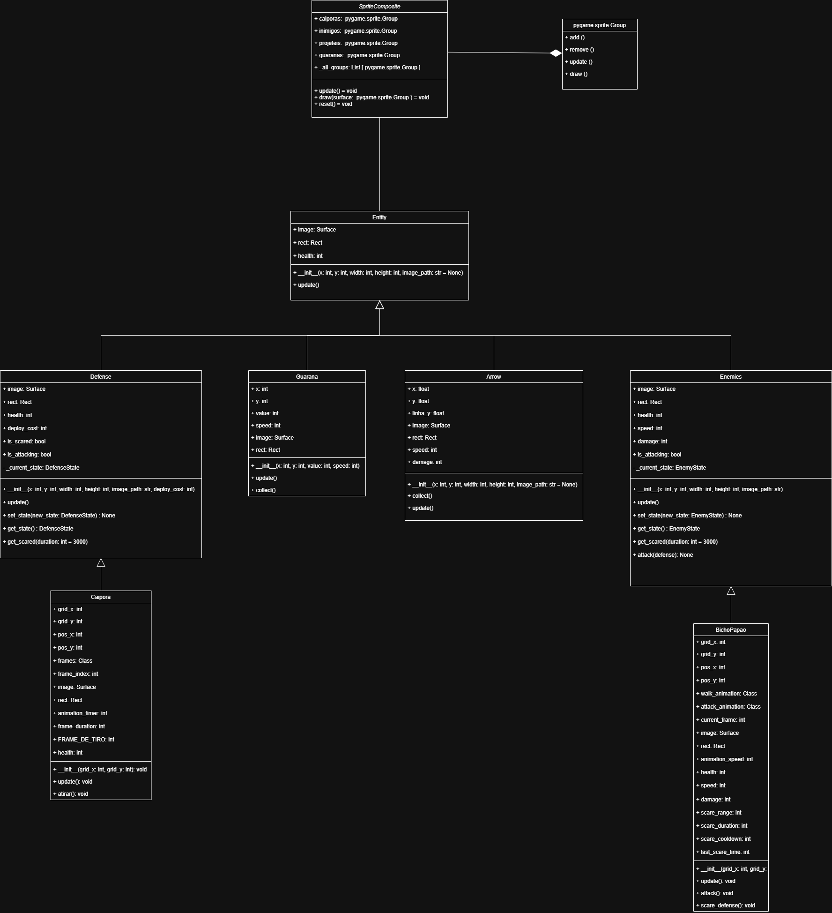

# 3.2. Módulo Padrões de Projeto GoFs Estruturais

## 3.2.1. Introdução

Os **Padrões de Projeto Comportamentais**, parte do catálogo da "Gang of Four" (GoF) <a href="#REF1">[1]</a>, representam um conjunto de soluções consagradas para problemas recorrentes no design de *software* orientado a objetos. Diferentemente dos padrões Criacionais e Estruturais, que lidam com a criação e a composição de classes, os Comportamentais focam na **interação e comunicação entre objetos**.

Esses padrões são essenciais para definir como as responsabilidades são distribuídas e como a informação é trocada de forma flexível e eficiente dentro de um sistema [1]. Ao encapsular algoritmos e coordenar o fluxo de controle, eles visam **reduzir o acoplamento** entre classes e, consequentemente, tornar o código mais **adaptável a mudanças**, mais legível e mais fácil de manter. Eles fornecem um vocabulário comum para descrever o *comportamento* de um sistema, aumentando a robustez e a capacidade de extensão de uma aplicação.

## 3.2.2. Metodologia

A pesquisa e o desenvolvimento do estudo dos Padrões de Projeto Comportamentais foram conduzidos seguindo uma abordagem prática e colaborativa, focada na aplicação real dos conceitos em um sistema de *software* existente.

### 3.2.2.1. Revisão e Seleção de Padrões
Iniciou-se com a revisão do catálogo de Padrões de Projeto Comportamentais da "Gang of Four" (GoF), conforme introduzido na seção anterior. Foram selecionados os padrões mais relevantes para resolver problemas de interação e comunicação observados no **software interno do jogo**, que está hospedado em um repositório de código separado.

### 3.2.2.2. Aplicação e Implementação
Os padrões de projeto selecionados (*Facade* e *Composite*) foram implementados diretamente no código-fonte do *software* interno do jogo. Esta etapa foi crucial para testar a eficácia dos padrões na redução do acoplamento, melhoria da legibilidade e aumento da flexibilidade do sistema.

### 3.2.2.3. Modelagem e Documentação UML
Para documentar visualmente a estrutura e a aplicação dos padrões, o *software* **Draw.io** foi utilizado para a criação de **Diagramas UML (Linguagem de Modelagem Unificada)**. Esses diagramas (principalmente de Classe e/ou Sequência) serviram para mapear as novas interações e relações entre os objetos resultantes da aplicação dos padrões Comportamentais.

### 3.2.2.4. Demonstração e Colaboração
Para garantir a transparência do processo e documentar a participação de cada membro, as sessões de desenvolvimento, discussões técnicas e demonstrações de execução do código foram **gravadas por meio da plataforma Microsoft Teams**. Essas gravações serviram como artefatos de evidência, demonstrando a aplicação prática dos padrões, o fluxo de trabalho colaborativo e a contribuição individual dos membros da equipe na solução dos problemas de design.

## **3.2.3. Composite**

O padrão **Composite** é um padrão de projeto estrutural que visa **compor objetos em estruturas de árvore** para representar hierarquias **"parte-todo"**.

A intenção principal é permitir que os clientes (código que utiliza a estrutura) **tratem objetos individuais e composições de objetos de maneira uniforme**.

### **3.2.3.1. Diagrama UML**

O GoF Estrutural *Composite* foi aplicado ao projeto, no seguinte código:


???+ note "Aplicação do Padrão Composite (Gerenciamento de Sprites)"
    O trecho de código a seguir, extraído do arquivo principal de gerenciamento de *sprites* (`sprite_groups.py`) demonstra a implementação do Padrão Composite através da classe `SpriteComposite`.  
    Essa classe unifica a gestão de diversos grupos de *sprites* (`caiporas`, `inimigos`, `projeteis`, etc.) permitindo que operações como `update()` e `draw()` sejam executadas de forma transparente em todos os grupos de uma só vez.

    ```python
    import pygame
    from Template.UIConfigs import *

    class SpriteComposite:
        """Gerenciador unificado de todos os grupos de sprites do jogo."""
        def __init__(self):
            self.caiporas = pygame.sprite.Group()
            self.inimigos = pygame.sprite.Group()
            self.projeteis = pygame.sprite.Group()
            self.guaranas = pygame.sprite.Group()

            self._all_groups = [
                self.projeteis,
                self.caiporas,
                self.inimigos,
                self.guaranas
            ]

        def update(self):
            for group in self._all_groups:
                group.update()

        def draw(self, surface):
            for group in self._all_groups:
                group.draw(surface)

        def reset(self):
            for group in self._all_groups:
                group.empty()

    sprite_manager = SpriteComposite()
    ```

Portanto, assim ficou modelado em UML, o padrão Composite no código do jogo. Clique aqui para [acessar](https://app.diagrams.net/#G1p7RkwHkF4gsjF1OD6TZ4vaDRCexq4uEc#%7B"pageId"%3A"C5RBs43oDa-KdzZeNtuy"%7D):

[](https://app.diagrams.net/#G1p7RkwHkF4gsjF1OD6TZ4vaDRCexq4uEc#%7B"pageId"%3A"C5RBs43oDa-KdzZeNtuy"%7D)

O diagrama acima ilustra a **arquitetura de classes responsável pelo gerenciamento de sprites** no jogo, evidenciando como o **Padrão de Projeto Composite** foi aplicado para unificar e organizar diferentes tipos de entidades (como personagens, inimigos, projéteis e defesas) sob uma mesma estrutura de controle.

No topo, encontra-se a classe **`SpriteComposite`**, que atua como o **componente composto principal**. Ela agrega diversos grupos de sprites — como `caiporas`, `inimigos`, `projeteis` e `guaranas` —, todos representados por instâncias de `pygame.sprite.Group`. Essa classe possui métodos como `update()` e `draw()`, que **propagam as operações** de atualização e renderização para todos os grupos internos, mantendo a hierarquia de forma transparente.

Logo abaixo, a classe **`Entity`** funciona como a **classe base abstrata** para todos os objetos que possuem representação visual e comportamento no jogo. Ela define atributos comuns, como:

- `image`: superfície gráfica da entidade.  
- `rect`: posição e área de colisão.  
- `health`: quantidade de vida da entidade.  
- `update()`: método genérico para atualização, que pode ser sobrescrito pelas subclasses.

As classes derivadas de `Entity` representam os **tipos específicos de entidades do jogo**, sendo elas:

- **`Defesa`**: define estruturas defensivas com atributos de custo, estado atual e comportamento de bloqueio.  
- **`Guarana`**: representa a moeda do jogo, possuindo atributos de velocidade, imagem e método de colisão (`collide()`).  
- **`Arrow`**: modela flechas ou projéteis inimigos, com propriedades de dano e trajetória.  
- **`Enemies`**: classe genérica para inimigos, contendo lógica de movimento, estado e ataque.

Além disso, há classes especializadas que **herdam dessas entidades principais**:

- **`Caipora`**: herda de `Defesa` e adiciona comportamentos específicos, como animações, ataques e controle de tempo de ação.  
- **`BichoPapao`**: herda de `Enemies` e especializa os parâmetros de dano, velocidade e animações de ataque.

Essa organização reflete o uso do **Composite** aliado à **herança hierárquica**:

- O `SpriteComposite` **orquestra** todos os grupos de entidades do jogo.  
- Cada entidade, derivada de `Entity`, **atua como um componente individual** dentro dessa estrutura unificada.

Em resumo, o diagrama mostra **uma hierarquia bem definida e extensível**, em que o Composite (`SpriteComposite`) gerencia múltiplos objetos (entidades e subclasses) como se fossem um único conjunto, favorecendo a coesão e o baixo acoplamento entre os módulos do sistema.

### **3.2.3.2. Vídeo Demonstrativo**

Foi gravado, na plataforma do Microsoft Teams, uma reunião para a modelagem UML do padrão Composite e a execução do código além da explicação do mesmo. Clique [aqui](https://youtu.be/62f51kDLWNQ?si=3HCpRg2Mn46kOYO0) para acessar.

<iframe width="560" height="315" src="https://youtu.be/62f51kDLWNQ?si=3HCpRg2Mn46kOYO0" title="YouTube video player" frameborder="0" allowfullscreen></iframe>
## 3.2.5 Referências Bibliográficas

<a id="REF1">[1] GAMMA, Erich et al. **Padrões de Projeto: Soluções Reutilizáveis de Software Orientado a Objetos**. Tradução de C. F. Lucena e F. S. C. da Silva. Porto Alegre: Bookman, 2007. (Título original: *Design Patterns: Elements of Reusable Object-Oriented Software*).