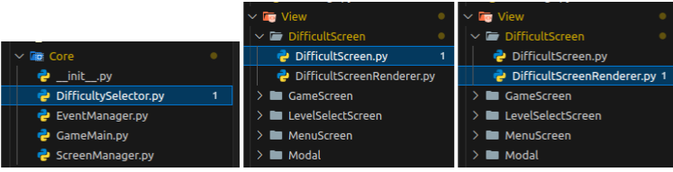
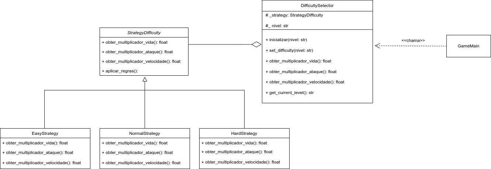

# 3.3. Módulo Padrões de Projeto GoFs Comportamentais

## 3.3.1. Introdução

Os **Padrões de Projeto Comportamentais** fazem parte do conjunto de soluções proposto pela "Gang of Four" (GoF) <a href="#REF1">[1]</a> para lidar com desafios recorrentes na modelagem de sistemas orientados a objetos. Enquanto os padrões Criacionais tratam da instânciação de objetos e os Estruturais da organização entre classes e interfaces, os **Comportamentais** concentram-se na **dinâmica da comunicação entre objetos**, promovendo uma colaboração mais eficaz e desacoplada.

Esses padrões são fundamentais para estabelecer **fluxos de controle flexíveis**, permitindo que algoritmos sejam encapsulados e substituídos sem afetar o restante da aplicação. Ao distribuir responsabilidades de forma estratégica, eles **favorecem a manutenção, extensibilidade e reutilização do código** <a href="#REF2">[2]</a>. No contexto do desenvolvimento de jogos eletrônicos, por exemplo, sua aplicação permite modularizar comportamentos complexos e dinâmicos, como demonstrado por Figueiredo em sua dissertação <a href="#REF3">[3]</a>, tornando os sistemas mais adaptáveis às exigências de interatividade e evolução constante.

## Participantes

<font size="3"><p style="text-align: center">Tabela 1: Participantes</p></font>

<div align="center">
<table>
  <thead>
    <tr>
      <th>Nome</th>
      <th>Função</th>
      <th>Data</th>
      <th>Hora</th>
    </tr>
  </thead>
  <tbody>
    <tr>
      <td><a href="https://github.com/caioduart3">Caio Duarte</a></td>
      <td>GoF Comportamental - State</td>
      <td>22/10/2025</td>
      <td>20:00</td>
    </tr>
    <tr>
      <td><a href="https://github.com/danielle-soaress">Danielle Soares</a></td>
      <td>GoF Comportamental - Itarator</td>
      <td>22/10/2025</td>
      <td>11:00</td>
    </tr>
    <tr>
      <td><a href="https://github.com/EnzoEmir">Enzo Emir</a></td>
      <td>GoF Comportamental - Strategy</td>
      <td>21/10/2025</td>
      <td>20:00</td>
    </tr>
    <tr>
      <td><a href="https://github.com/felixlaryssa">Laryssa Félix</a></td>
      <td>GoF Comportamental -  Strategy</td>
      <td>21/10/2025</td>
      <td>20:00</td>
    </tr>
    <tr>
      <td><a href="https://github.com/Leticia-Arisa-K-Higa">Leticia Arisa</a></td>
      <td>GoF Comportamental - Itarator</td>
      <td>22/10/2025</td>
      <td>11:00</td>
    </tr>
    <tr>
      <td><a href="https://github.com/MM4k">Marcelo Makoto</a></td>
      <td>GoF Comportamental - State</td>
      <td>22/10/2025</td>
      <td>20:00</td>
    </tr>
    <tr>
      <td><a href="https://github.com/dudaa28">Maria Eduarda</a></td>
      <td>GoF Comportamental - Itarator</td>
      <td>22/10/2025</td>
      <td>20:00</td>
    </tr>
    <tr>
      <td><a href="https://github.com/RafaelSchadt">Rafael Welz</a></td>
      <td>GoF Comportamental - Strategy</td>
      <td>21/10/2025</td>
      <td>20:00</td>
    </tr>
    <tr>
      <td><a href="https://github.com/VictorPontual">Victor Pontual</a></td>
      <td>GoF Comportamental - State</td>
      <td>20/10/2025</td>
      <td>11:00</td>
    </tr>
  </tbody>
</table>
</div>

<font size="2"><p style="text-align: center">Fonte: Equipe do Projeto, 2025.</p></font>


## 3.3.2. Metodologia

A pesquisa e o desenvolvimento do estudo dos Padrões de Projeto Comportamentais foram conduzidos seguindo uma abordagem prática e colaborativa, focada na aplicação real dos conceitos em um sistema de *software* existente.

### 3.3.2.1. Revisão e Seleção de Padrões
Iniciou-se com a revisão do catálogo de Padrões de Projeto Comportamentais da "Gang of Four" (GoF), conforme introduzido na seção anterior. Foram selecionados os padrões mais relevantes para resolver problemas de interação e comunicação observados no **software interno do jogo**, que está hospedado em um repositório de código separado.

### 3.3.2.2. Aplicação e Implementação
Os padrões de projeto selecionados (*Strategy*, *Itarator* e *State*) foram implementados diretamente no código-fonte do *software* interno do jogo. Esta etapa foi crucial para testar a eficácia dos padrões na redução do acoplamento, melhoria da legibilidade e aumento da flexibilidade do sistema.

### 3.3.2.3. Modelagem e Documentação UML
Para documentar visualmente a estrutura e a aplicação dos padrões, o *software* **Draw.io** foi utilizado para a criação de **Diagramas UML (Linguagem de Modelagem Unificada)**. Esses diagramas (principalmente de Classe e/ou Sequência) serviram para mapear as novas interações e relações entre os objetos resultantes da aplicação dos padrões Comportamentais.

### 3.3.2.4. Demonstração e Colaboração
Para garantir a transparência do processo e documentar a participação de cada membro, as sessões de desenvolvimento, discussões técnicas e demonstrações de execução do código foram **gravadas por meio da plataforma Microsoft Teams**. Essas gravações serviram como artefatos de evidência, demonstrando a aplicação prática dos padrões, o fluxo de trabalho colaborativo e a contribuição individual dos membros da equipe na solução dos problemas de design.

## **3.3.3. Strategy**

O padrão **Strategy** é um dos padrões comportamentais definidos pela Gang of Four (GoF) e tem como objetivo **encapsular algoritmos ou comportamentos distintos dentro de classes separadas**, permitindo que eles sejam intercambiáveis em tempo de execução.
Em vez de implementar diretamente um comportamento em uma classe, o Strategy propõe que esse comportamento seja delegado a um objeto externo, chamado de estratégia. Isso promove a **flexibilidade e o desacoplamento,** pois novas estratégias podem ser adicionadas ou modificadas sem alterar o código da classe principal.
Esse padrão é especialmente útil quando há **múltiplas variações de um mesmo processo,** como diferentes formas de ordenação, cálculo ou movimentação em jogos, por exemplo. Ao aplicar o Strategy, o sistema se torna mais extensível e testável.

## **3.3.3.1. Diagrama UML**

O GoF Comportamental *Strategy* foi aplicado ao projeto, nos seguintes códigos:


???+ note "Aplicação do Padrão Strategy (Níveis de Dificuldade)"
    O trecho de código a seguir, extraído do arquivo (`DifficultySelector.py`), demonstra     
    a aplicação do Padrão Strategy através da criação de diferentes estratégias de      
    *`dificuldade`*    (`EasyStrategy`, `NormalStrategy` e `HardStrategy`), todas herdando da interface abstrata `StrategyDifficulty`.  
    O seletor de dificuldade (`DifficultySelector`) atua como o contexto, delegando dinamicamente o comportamento conforme o nível selecionado pelo jogador.

    ```python
        import pygame
        from abc import ABC, abstractmethod

            class StrategyDifficulty(ABC):
                
                @abstractmethod
                def obter_multiplicador_vida(self) -> float: ...
                @abstractmethod
                def obter_multiplicador_ataque(self) -> float: ...
                @abstractmethod
                def obter_multiplicador_velocidade(self) -> float: ...
                
                def aplicar_regras(self):
                    print(f"[Core Log] Estratégia de Dificuldade '{self.__class__.__name__}' aplicada.")


            class EasyStrategy(StrategyDifficulty):
                def obter_multiplicador_vida(self): return 0.7
                def obter_multiplicador_ataque(self): return 0.7
                def obter_multiplicador_velocidade(self): return 0.9


            class NormalStrategy(StrategyDifficulty):
                def obter_multiplicador_vida(self): return 1.0
                def obter_multiplicador_ataque(self): return 1.0
                def obter_multiplicador_velocidade(self): return 1.0


            class HardStrategy(StrategyDifficulty):
                def obter_multiplicador_vida(self): return 1.5
                def obter_multiplicador_ataque(self): return 1.5
                def obter_multiplicador_velocidade(self): return 1.2


            class DifficultySelector:
                _strategy: StrategyDifficulty | None = None
                _nivel: str = 'normal'

                @classmethod
                def inicializar(cls, nivel='normal'):
                    cls.set_difficulty(nivel)

                @classmethod
                def set_difficulty(cls, nivel):
                    mapping = {'easy': EasyStrategy, 'normal': NormalStrategy, 'hard': HardStrategy}
                    cls._strategy = mapping.get(nivel.lower(), NormalStrategy)()
                    cls._nivel = nivel
                    cls._strategy.aplicar_regras()

                @classmethod
                def obter_multiplicador_vida(cls): return cls._strategy.obter_multiplicador_vida()
                @classmethod
                def obter_multiplicador_ataque(cls): return cls._strategy.obter_multiplicador_ataque()
                @classmethod
                def obter_multiplicador_velocidade(cls): return cls._strategy.obter_multiplicador_velocidade()
                @classmethod
                def get_current_level(cls): return cls._nivel
    ```

???+ note "Interface Visual de Seleção de Dificuldade"
    Já a interface visual para essa escolha está definida em `src/View/DifficultScreen.py`.  
    O arquivo `DifficultScreen.py` controla a lógica de interação do jogador, e o `DifficultScreenRenderer.py` cuida da renderização dos elementos gráficos da tela de seleção de dificuldade.

    ```python
        import pygame
        from Template.BaseScreen import BaseScreen
        from View.DifficultScreen.DifficultScreenRenderer import DifficultScreenRenderer
        from View.ViewRenderer import ViewRenderer  
        from View.InputHandler import InputHandler, InputType
        from enum import Enum

        class Difficulty(Enum):
            EASY = "easy"
            MEDIUM = "medium"
            HARD = "hard"

        class DifficultScreen(BaseScreen):
            def __init__(self):
                super().__init__()
                self.difficulties = {
                    Difficulty.EASY: {"name": "Fácil", "color": (100, 200, 100), "hover_color": (120, 220, 120)},
                    Difficulty.MEDIUM: {"name": "Médio", "color": (200, 200, 100), "hover_color": (220, 220, 120)},
                    Difficulty.HARD: {"name": "Difícil", "color": (200, 100, 100), "hover_color": (220, 120, 120)}
                }
                self.selected_difficulty = None
                self.renderer = DifficultScreenRenderer(self)

            def handle_event(self, event):
                tipo = InputHandler.classificar_evento(event)
                pos = InputHandler.mouse_posicao()

                if tipo == InputType.MOUSE and event.type == pygame.MOUSEBUTTONDOWN:
                    for difficulty, rect in self.difficulty_rects.items():
                        if rect.collidepoint(pos):
                            self.selected_difficulty = difficulty
                            print(f"Dificuldade selecionada: {self.difficulties[difficulty]['name']}")
                            break

            def _iniciar_jogo(self):
                from Core.DifficultySelector import DifficultySelector
                DifficultySelector.set_difficulty(self.selected_difficulty.value)
                # a partir daqui o jogo é iniciado com a estratégia selecionada
    ```


Portanto, assim ficou modelado em UML, o padrão Strategy no código do jogo. [Clique aqui](https://drive.google.com/file/d/1O_kNfro8bEsn3NAhUfbBjLvCst9_R5q0/view?usp=sharing)

[](https://drive.google.com/file/d/1O_kNfro8bEsn3NAhUfbBjLvCst9_R5q0/view?usp=sharing)
<font size="2"><p style="text-align: center">Fonte: [Laryssa Felix](https://github.com/felixlaryssa), [Enzo Emir]("https://github.com/EnzoEmir"), [Rafael Welz](https://github.com/RafaelSchadt) , 2025.</p></font>

#### Estrutura e Responsabilidades

- **`StrategyDifficulty`**  
Classe abstrata que define o contrato das estratégias de dificuldade, especificando os métodos necessários para determinar os multiplicadores de vida, ataque e velocidade.

- **`EasyStrategy, NormalStrategy, HardStrategy`**  
Implementações concretas do contrato de `StrategyDifficulty`.  
Cada uma define seus próprios multiplicadores, influenciando diretamente o equilíbrio do jogo.

- **`DifficultySelector`**  
Atua como o contexto do padrão.  
Ele gerencia a estratégia ativa e fornece métodos centralizados para recuperar os multiplicadores atuais, tornando a lógica de dificuldade independente da camada de visualização.

- **`DifficultScreen`**  
Classe responsável pela interação do jogador, exibindo opções de dificuldade e chamando `DifficultySelector.set_difficulty()` ao iniciar o jogo.

- **`DifficultScreenRenderer`**  
Responsável pela renderização gráfica da interface, apresentando os cartões de dificuldade com feedback visual (seleção, hover, desabilitado).

#### Benefícios da Aplicação

- **Flexibilidade:** novas dificuldades podem ser adicionadas facilmente, bastando criar uma nova classe que herde de `StrategyDifficulty`.
- **Baixo acoplamento:** o código de renderização e interação não depende de detalhes de implementação da dificuldade.
- **Extensibilidade:** permite ajustar regras de vida, dano e velocidade sem alterar a estrutura central do jogo.
- **Coesão:** cada classe tem uma responsabilidade clara e isolada (render, lógica de input, regras do jogo, etc.).

Esse design evidencia o uso bem estruturado do **GoF Comportamental Strategy**, ao encapsular variações de comportamento (níveis de dificuldade) em classes independentes e permitir que o jogo altere sua lógica de forma modular, escalável e de fácil manutenção.


### 3.3.3.2. Opniões dos Participantes

A elaboração desta etapa foi realizada de forma colaborativa em reunião pelo **Discord**, não gravada,  onde os três membros designados estiveram presentes e participaram ativamente da discussão/elaboração.  
O processo da execução do código foi feito no **Visual Studio Code** e a elaboração da UML foi feita no **Draw.io**, ferramenta que possibilitou a criação e edição simultânea do diagrama, garantindo integração e alinhamento entre os integrantes.  

Ao longo da atividade, cada integrante trouxe ideias e feedbacks que ajudaram a consolidar um resultado alinhado com a visão do grupo como um todo. Esse processo coletivo contribuiu tanto para a consistência do diagrama quanto para o fortalecimento da colaboração na equipe.

<details>
  <summary><strong><a href="https://github.com/EnzoEmir">Enzo Emir</a></strong></summary>
  <p>Pesquisando percebi que uma vantagem do Strategy é sua contribuição para a testabilidade do sistema. Como os comportamentos estão isolados em classes específicas, é possível testar cada estratégia de forma independente, sem depender do contexto completo. Isso favorece a criação de simulações controladas, especialmente útil em sistemas complexos ou com lógica sensível, como IA de jogos, cálculos financeiros ou regras de negócio.</p>
</details>

<details>
  <summary><strong><a href="https://github.com/felixlaryssa">Laryssa Félix</a></strong></summary>
  <p>O padrão Strategy é uma solução elegante para cenários em que múltiplos comportamentos precisam ser alternados dinamicamente. Sua principal força está na flexibilidade: ao encapsular algoritmos em classes separadas, ele permite que o sistema evolua sem a necessidade de modificar o código existente. Isso é especialmente útil em jogos digitais, onde diferentes estilos de inimigos, níveis de dificuldade ou modos de ataque podem ser implementados como estratégias distintas.</p>
</details>

<details>
  <summary><strong><a href="https://github.com/RafaelSchadt">Rafael Schadt</a></strong></summary>
  <p>A implementação do padrão Strategy para as dificuldades do jogo (Easy, Normal, Hard) pareceu desnecessariamente complexa à primeira vista. Questionei a necessidade de múltiplas classes quando uma condicional básica resolvia. No entanto, o valor veio na prática: encapsular cada regra de dificuldade isoladamente garantiu uma estrutura impecável. A adição de novos modos (mesmo que futuramente) se tornou trivial e limpa, confirmando a eficácia e elegância do padrão.</p>
</details>

### 3.3.3.3. Vídeo Demonstrativo

Foi gravado, na plataforma do Microsoft Teams, uma reunião para a modelagem UML do padrão Strategy e a execução do código além da explicação do mesmo. Clique [aqui](https://youtu.be/62f51kDLWNQ?si=3HCpRg2Mn46kOYO0) para acessar.


<iframe width="560" height="315" src="https://www.youtube.com/embed/QKZyKbrpQQ8?si=gybvhCSWl1TLhJGv" title="YouTube video player" frameborder="0" allow="accelerometer; autoplay; clipboard-write; encrypted-media; gyroscope; picture-in-picture; web-share" referrerpolicy="strict-origin-when-cross-origin" allowfullscreen></iframe>

## 3.3.4 Referências Bibliográficas

[1] GAMMA, Erich et al. **Padrões de Projeto: Soluções Reutilizáveis de Software Orientado a Objetos**. Tradução de C. F. Lucena e F. S. C. da Silva. Porto Alegre: Bookman, 2007. (Título original: *Design Patterns: Elements of Reusable Object-Oriented Software*).

[2] SERRANO, Milene. Aula – GOFs Comportamentais. Arquitetura e Desenho de Software. Universidade de Brasília – UnB Gama, [s.d.]. Material de aula (apresentação de slides).

[3] FIGUEIREDO, Roberto Tenório. Padrões de Projeto GOF aplicados ao Desenvolvimento de Jogos Eletrônicos. 2014. 123 f. Dissertação (Mestrado em Ciência da Computação) – Universidade Federal de Pernambuco, Centro de Informática, Recife, 2014.


## Histórico de Versões 📅

| Versão | Data | Descrição | Autor(es) | Revisor(es) |
| :--: | :--: | :--: | :--: | :--: |
| `0.1` | 24/10/2025 | Adicionando Documentação GoF Comportamental | [Laryssa Felix](https://github.com/felixlaryssa) | [Caio Duarte](https://github.com/caioduart3) |
| `0.2` | 24/10/2025 | Ajustes Documentação GoF Comportamental | [Laryssa Felix](https://github.com/felixlaryssa), [Enzo Emir]("https://github.com/EnzoEmir"), [Rafael Welz](https://github.com/RafaelSchadt) | [Caio Duarte](https://github.com/caioduart3) |