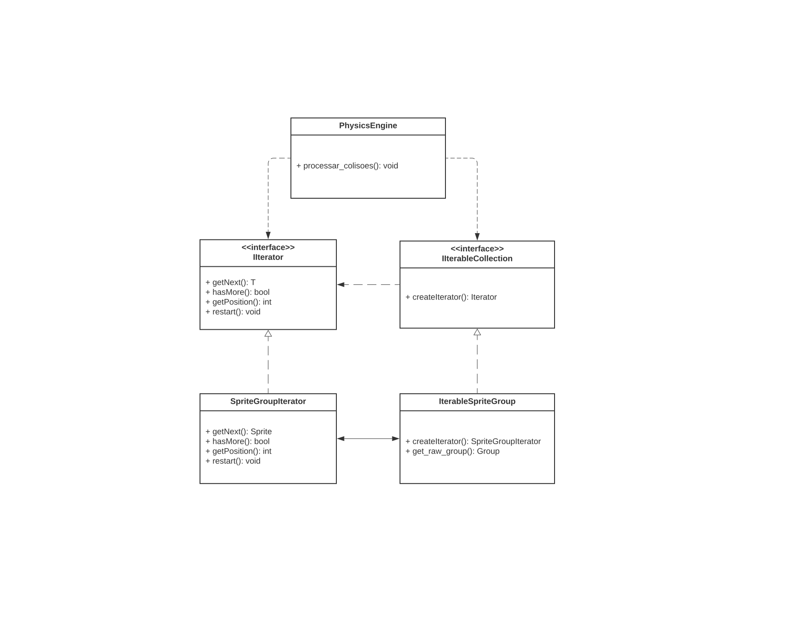
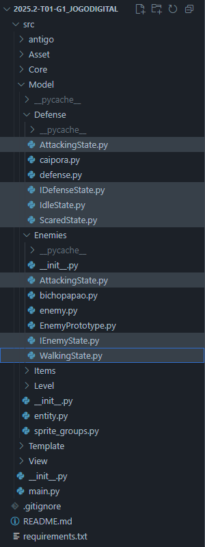
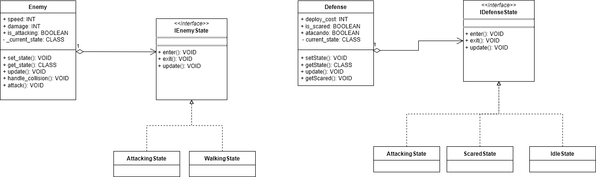

# 3.3. Módulo Padrões de Projeto GoFs Comportamentais

## 3.3.1. Introdução

Os **Padrões de Projeto Comportamentais** fazem parte do conjunto de soluções proposto pela "Gang of Four" (GoF) <a href="#REF1">[1]</a> para lidar com desafios recorrentes na modelagem de sistemas orientados a objetos. Enquanto os padrões Criacionais tratam da instânciação de objetos e os Estruturais da organização entre classes e interfaces, os **Comportamentais** concentram-se na **dinâmica da comunicação entre objetos**, promovendo uma colaboração mais eficaz e desacoplada.

Esses padrões são fundamentais para estabelecer **fluxos de controle flexíveis**, permitindo que algoritmos sejam encapsulados e substituídos sem afetar o restante da aplicação. Ao distribuir responsabilidades de forma estratégica, eles **favorecem a manutenção, extensibilidade e reutilização do código** <a href="#REF2">[2]</a>. No contexto do desenvolvimento de jogos eletrônicos, por exemplo, sua aplicação permite modularizar comportamentos complexos e dinâmicos, como demonstrado por Figueiredo em sua dissertação <a href="#REF3">[3]</a>, tornando os sistemas mais adaptáveis às exigências de interatividade e evolução constante.

## Participantes

<font size="3"><p style="text-align: center">Tabela 1: Participantes</p></font>

<div align="center">
<table>
  <thead>
    <tr>
      <th>Nome</th>
      <th>Função</th>
      <th>Data</th>
      <th>Hora</th>
    </tr>
  </thead>
  <tbody>
    <tr>
      <td><a href="https://github.com/caioduart3">Caio Duarte</a></td>
      <td>GoF Comportamental - State</td>
      <td>22/10/2025</td>
      <td>20:00</td>
    </tr>
    <tr>
      <td><a href="https://github.com/danielle-soaress">Danielle Soares</a></td>
      <td>GoF Comportamental - Iterator</td>
      <td>22/10/2025</td>
      <td>19:30</td>
    </tr>
    <tr>
      <td><a href="https://github.com/EnzoEmir">Enzo Emir</a></td>
      <td>GoF Comportamental - Strategy</td>
      <td>21/10/2025</td>
      <td>20:00</td>
    </tr>
    <tr>
      <td><a href="https://github.com/felixlaryssa">Laryssa Félix</a></td>
      <td>GoF Comportamental -  Strategy</td>
      <td>21/10/2025</td>
      <td>20:00</td>
    </tr>
    <tr>
      <td><a href="https://github.com/Leticia-Arisa-K-Higa">Leticia Arisa</a></td>
      <td>GoF Comportamental - Iterator</td>
      <td>22/10/2025</td>
      <td>19:30</td>
    </tr>
    <tr>
      <td><a href="https://github.com/MM4k">Marcelo Makoto</a></td>
      <td>GoF Comportamental - State</td>
      <td>22/10/2025</td>
      <td>20:00</td>
    </tr>
    <tr>
      <td><a href="https://github.com/dudaa28">Maria Eduarda</a></td>
      <td>GoF Comportamental - Iterator</td>
      <td>22/10/2025</td>
      <td>19:30</td>
    </tr>
    <tr>
      <td><a href="https://github.com/RafaelSchadt">Rafael Welz</a></td>
      <td>GoF Comportamental - Strategy</td>
      <td>21/10/2025</td>
      <td>20:00</td>
    </tr>
    <tr>
      <td><a href="https://github.com/VictorPontual">Victor Pontual</a></td>
      <td>GoF Comportamental - State</td>
      <td>20/10/2025</td>
      <td>11:00</td>
    </tr>
  </tbody>
</table>
</div>

<font size="2"><p style="text-align: center">Fonte: Equipe do Projeto, 2025.</p></font>


## 3.3.2. Metodologia

A pesquisa e o desenvolvimento do estudo dos Padrões de Projeto Comportamentais foram conduzidos seguindo uma abordagem prática e colaborativa, focada na aplicação real dos conceitos em um sistema de *software* existente.

### 3.3.2.1. Revisão e Seleção de Padrões
Iniciou-se com a revisão do catálogo de Padrões de Projeto Comportamentais da "Gang of Four" (GoF), conforme introduzido na seção anterior. Foram selecionados os padrões mais relevantes para resolver problemas de interação e comunicação observados no **software interno do jogo**, que está hospedado em um repositório de código separado.

### 3.3.2.2. Aplicação e Implementação
Os padrões de projeto selecionados (*Strategy*, *Iterator* e *State*) foram implementados diretamente no código-fonte do *software* interno do jogo. Esta etapa foi crucial para testar a eficácia dos padrões na redução do acoplamento, melhoria da legibilidade e aumento da flexibilidade do sistema.

### 3.3.2.3. Modelagem e Documentação UML
Para documentar visualmente a estrutura e a aplicação dos padrões, o *software* **Draw.io** foi utilizado para a criação de **Diagramas UML (Linguagem de Modelagem Unificada)**. Esses diagramas (principalmente de Classe e/ou Sequência) serviram para mapear as novas interações e relações entre os objetos resultantes da aplicação dos padrões Comportamentais.

### 3.3.2.4. Demonstração e Colaboração
Para garantir a transparência do processo e documentar a participação de cada membro, as sessões de desenvolvimento, discussões técnicas e demonstrações de execução do código foram **gravadas por meio da plataforma Microsoft Teams**. Essas gravações serviram como artefatos de evidência, demonstrando a aplicação prática dos padrões, o fluxo de trabalho colaborativo e a contribuição individual dos membros da equipe na solução dos problemas de design.

## **3.3.3. Strategy**

O padrão **Strategy** é um dos padrões comportamentais definidos pela Gang of Four (GoF) e tem como objetivo **encapsular algoritmos ou comportamentos distintos dentro de classes separadas**, permitindo que eles sejam intercambiáveis em tempo de execução.
Em vez de implementar diretamente um comportamento em uma classe, o Strategy propõe que esse comportamento seja delegado a um objeto externo, chamado de estratégia. Isso promove a **flexibilidade e o desacoplamento,** pois novas estratégias podem ser adicionadas ou modificadas sem alterar o código da classe principal.
Esse padrão é especialmente útil quando há **múltiplas variações de um mesmo processo,** como diferentes formas de ordenação, cálculo ou movimentação em jogos, por exemplo. Ao aplicar o Strategy, o sistema se torna mais extensível e testável.

## **3.3.3.1. Diagrama UML**

O GoF Comportamental *Strategy* foi aplicado ao projeto, nos seguintes códigos:


<font size="2"><p style="text-align: center">Fonte: [Laryssa Felix](https://github.com/felixlaryssa), [Enzo Emir]("https://github.com/EnzoEmir"), [Rafael Welz](https://github.com/RafaelSchadt) , 2025.</p></font>

???+ note "Aplicação do Padrão Strategy (Níveis de Dificuldade)"
    O trecho de código a seguir, extraído do arquivo (`DifficultySelector.py`), demonstra     
    a aplicação do Padrão Strategy através da criação de diferentes estratégias de      
    *`dificuldade`*    (`EasyStrategy`, `NormalStrategy` e `HardStrategy`), todas herdando da interface abstrata `StrategyDifficulty`.  
    O seletor de dificuldade (`DifficultySelector`) atua como o contexto, delegando dinamicamente o comportamento conforme o nível selecionado pelo jogador.

    ```python
        import pygame
        from abc import ABC, abstractmethod

            class StrategyDifficulty(ABC):
                
                @abstractmethod
                def obter_multiplicador_vida(self) -> float: ...
                @abstractmethod
                def obter_multiplicador_ataque(self) -> float: ...
                @abstractmethod
                def obter_multiplicador_velocidade(self) -> float: ...
                
                def aplicar_regras(self):
                    print(f"[Core Log] Estratégia de Dificuldade '{self.__class__.__name__}' aplicada.")


            class EasyStrategy(StrategyDifficulty):
                def obter_multiplicador_vida(self): return 0.7
                def obter_multiplicador_ataque(self): return 0.7
                def obter_multiplicador_velocidade(self): return 0.9


            class NormalStrategy(StrategyDifficulty):
                def obter_multiplicador_vida(self): return 1.0
                def obter_multiplicador_ataque(self): return 1.0
                def obter_multiplicador_velocidade(self): return 1.0


            class HardStrategy(StrategyDifficulty):
                def obter_multiplicador_vida(self): return 1.5
                def obter_multiplicador_ataque(self): return 1.5
                def obter_multiplicador_velocidade(self): return 1.2


            class DifficultySelector:
                _strategy: StrategyDifficulty | None = None
                _nivel: str = 'normal'

                @classmethod
                def inicializar(cls, nivel='normal'):
                    cls.set_difficulty(nivel)

                @classmethod
                def set_difficulty(cls, nivel):
                    mapping = {'easy': EasyStrategy, 'normal': NormalStrategy, 'hard': HardStrategy}
                    cls._strategy = mapping.get(nivel.lower(), NormalStrategy)()
                    cls._nivel = nivel
                    cls._strategy.aplicar_regras()

                @classmethod
                def obter_multiplicador_vida(cls): return cls._strategy.obter_multiplicador_vida()
                @classmethod
                def obter_multiplicador_ataque(cls): return cls._strategy.obter_multiplicador_ataque()
                @classmethod
                def obter_multiplicador_velocidade(cls): return cls._strategy.obter_multiplicador_velocidade()
                @classmethod
                def get_current_level(cls): return cls._nivel
    ```

???+ note "Interface Visual de Seleção de Dificuldade"
    Já a interface visual para essa escolha está definida em `src/View/DifficultScreen.py`.  
    O arquivo `DifficultScreen.py` controla a lógica de interação do jogador, e o `DifficultScreenRenderer.py` cuida da renderização dos elementos gráficos da tela de seleção de dificuldade.

    ```python
        import pygame
        from Template.BaseScreen import BaseScreen
        from View.DifficultScreen.DifficultScreenRenderer import DifficultScreenRenderer
        from View.ViewRenderer import ViewRenderer  
        from View.InputHandler import InputHandler, InputType
        from enum import Enum

        class Difficulty(Enum):
            EASY = "easy"
            MEDIUM = "medium"
            HARD = "hard"

        class DifficultScreen(BaseScreen):
            def __init__(self):
                super().__init__()
                self.difficulties = {
                    Difficulty.EASY: {"name": "Fácil", "color": (100, 200, 100), "hover_color": (120, 220, 120)},
                    Difficulty.MEDIUM: {"name": "Médio", "color": (200, 200, 100), "hover_color": (220, 220, 120)},
                    Difficulty.HARD: {"name": "Difícil", "color": (200, 100, 100), "hover_color": (220, 120, 120)}
                }
                self.selected_difficulty = None
                self.renderer = DifficultScreenRenderer(self)

            def handle_event(self, event):
                tipo = InputHandler.classificar_evento(event)
                pos = InputHandler.mouse_posicao()

                if tipo == InputType.MOUSE and event.type == pygame.MOUSEBUTTONDOWN:
                    for difficulty, rect in self.difficulty_rects.items():
                        if rect.collidepoint(pos):
                            self.selected_difficulty = difficulty
                            print(f"Dificuldade selecionada: {self.difficulties[difficulty]['name']}")
                            break

            def _iniciar_jogo(self):
                from Core.DifficultySelector import DifficultySelector
                DifficultySelector.set_difficulty(self.selected_difficulty.value)
                # a partir daqui o jogo é iniciado com a estratégia selecionada
    ```


Portanto, assim ficou modelado em UML, o padrão Strategy no código do jogo. [Clique aqui](https://drive.google.com/file/d/1O_kNfro8bEsn3NAhUfbBjLvCst9_R5q0/view?usp=sharing)

[](https://drive.google.com/file/d/1O_kNfro8bEsn3NAhUfbBjLvCst9_R5q0/view?usp=sharing)

<font size="2"><p style="text-align: center">Fonte: [Laryssa Felix](https://github.com/felixlaryssa), [Enzo Emir]("https://github.com/EnzoEmir"), [Rafael Welz](https://github.com/RafaelSchadt) , 2025.</p></font>

#### Estrutura e Responsabilidades

- **`StrategyDifficulty`**  
Classe abstrata que define o contrato das estratégias de dificuldade, especificando os métodos necessários para determinar os multiplicadores de vida, ataque e velocidade.

- **`EasyStrategy, NormalStrategy, HardStrategy`**  
Implementações concretas do contrato de `StrategyDifficulty`.  
Cada uma define seus próprios multiplicadores, influenciando diretamente o equilíbrio do jogo.

- **`DifficultySelector`**  
Atua como o contexto do padrão.  
Ele gerencia a estratégia ativa e fornece métodos centralizados para recuperar os multiplicadores atuais, tornando a lógica de dificuldade independente da camada de visualização.

- **`DifficultScreen`**  
Classe responsável pela interação do jogador, exibindo opções de dificuldade e chamando `DifficultySelector.set_difficulty()` ao iniciar o jogo.

- **`DifficultScreenRenderer`**  
Responsável pela renderização gráfica da interface, apresentando os cartões de dificuldade com feedback visual (seleção, hover, desabilitado).

#### Benefícios da Aplicação

- **Flexibilidade:** novas dificuldades podem ser adicionadas facilmente, bastando criar uma nova classe que herde de `StrategyDifficulty`.
- **Baixo acoplamento:** o código de renderização e interação não depende de detalhes de implementação da dificuldade.
- **Extensibilidade:** permite ajustar regras de vida, dano e velocidade sem alterar a estrutura central do jogo.
- **Coesão:** cada classe tem uma responsabilidade clara e isolada (render, lógica de input, regras do jogo, etc.).

Esse design evidencia o uso bem estruturado do **GoF Comportamental Strategy**, ao encapsular variações de comportamento (níveis de dificuldade) em classes independentes e permitir que o jogo altere sua lógica de forma modular, escalável e de fácil manutenção.


### 3.3.3.2. Opiniões dos Participantes

A elaboração desta etapa foi realizada de forma colaborativa em reunião pelo **Discord**, não gravada,  onde os três membros designados estiveram presentes e participaram ativamente da discussão/elaboração.  
O processo da execução do código foi feito no **Visual Studio Code** e a elaboração da UML foi feita no **Draw.io**, ferramenta que possibilitou a criação e edição simultânea do diagrama, garantindo integração e alinhamento entre os integrantes.  

Ao longo da atividade, cada integrante trouxe ideias e feedbacks que ajudaram a consolidar um resultado alinhado com a visão do grupo como um todo. Esse processo coletivo contribuiu tanto para a consistência do diagrama quanto para o fortalecimento da colaboração na equipe.

<details>
  <summary><strong><a href="https://github.com/EnzoEmir">Enzo Emir</a></strong></summary>
  <p>Pesquisando percebi que uma vantagem do Strategy é sua contribuição para a testabilidade do sistema. Como os comportamentos estão isolados em classes específicas, é possível testar cada estratégia de forma independente, sem depender do contexto completo. Isso favorece a criação de simulações controladas, especialmente útil em sistemas complexos ou com lógica sensível, como IA de jogos, cálculos financeiros ou regras de negócio.</p>
</details>

<details>
  <summary><strong><a href="https://github.com/felixlaryssa">Laryssa Félix</a></strong></summary>
  <p>O padrão Strategy é uma solução elegante para cenários em que múltiplos comportamentos precisam ser alternados dinamicamente. Sua principal força está na flexibilidade: ao encapsular algoritmos em classes separadas, ele permite que o sistema evolua sem a necessidade de modificar o código existente. Isso é especialmente útil em jogos digitais, onde diferentes estilos de inimigos, níveis de dificuldade ou modos de ataque podem ser implementados como estratégias distintas.</p>
</details>

<details>
  <summary><strong><a href="https://github.com/RafaelSchadt">Rafael Schadt</a></strong></summary>
  <p>A implementação do padrão Strategy para as dificuldades do jogo (Easy, Normal, Hard) pareceu desnecessariamente complexa à primeira vista. Questionei a necessidade de múltiplas classes quando uma condicional básica resolvia. No entanto, o valor veio na prática: encapsular cada regra de dificuldade isoladamente garantiu uma estrutura impecável. A adição de novos modos (mesmo que futuramente) se tornou trivial e limpa, confirmando a eficácia e elegância do padrão.</p>
</details>

### 3.3.3.3. Vídeo Demonstrativo

Foi gravado, na plataforma do Microsoft Teams, uma reunião para a modelagem UML do padrão Strategy e a execução do código além da explicação do mesmo. Clique [aqui](https://youtu.be/62f51kDLWNQ?si=3HCpRg2Mn46kOYO0) para acessar.


<div style="text-align: center;">
  <iframe width="560" height="315" src="https://www.youtube.com/embed/QKZyKbrpQQ8?si=gybvhCSWl1TLhJGv" title="YouTube video player" frameborder="0" allow="accelerometer; autoplay; clipboard-write; encrypted-media; gyroscope; picture-in-picture; web-share" referrerpolicy="strict-origin-when-cross-origin" allowfullscreen></iframe>
</div>


## **3.3.4. Iterator**

O padrão Iterator é um padrão de projeto comportamental que fornece uma maneira de sequencialmente os elementos de um objeto de coleção sem expor sua representação interna (lista, pilha, árvore, etc.)

A intenção principal é permitir que os clientes (código que utiliza a estrutura) percorram a coleção usando uma interface comum, independentemente da estrutura de dados específica que a implementa.

### **3.3.4.1 Diagrama UML**

O GoF Comportamental Interator foi aplicado ao projeto, nos seguintes códigos:

???+ note "Interface Iterador"
    ```python
    from abc import ABC, abstractmethod
    from typing import TypeVar, Generic


    T = TypeVar('T')


    class IIterator(ABC, Generic[T]):
    """
    Declara as operações necessárias para percorrer uma coleção.
    """
    
    @abstractmethod
    def getNext(self) -> T:
        """
        Pega o próximo elemento da iteração.
        """
        pass


    @abstractmethod
    def hasMore(self) -> bool:
        """
        Verifica se ainda há elementos para percorrer.
        """
        pass


    @abstractmethod
    def getPosition(self) -> int:
        """
        Retorna o índice ou posição atual do iterador.
        """
        pass


    @abstractmethod
    def restart(self):
        """
        Reinicia o iterador, voltando para a primeira posição.
        """
        pass


    class IIterableCollection(ABC, Generic[T]):
    """
    Declara um ou mais métodos para obter iteradores.
    """
    
    @abstractmethod
    def createIterator(self) -> IIterator[T]:
        """
        Retorna uma nova instância de um iterador compatível.
        """
        pass
    ```

???+ note "Iteradores Concretos"
    ```python
    import pygame
    from typing import TypeVar
    from .interfaces import IIterator, IIterableCollection


    # Define que 'T' deve ser sempre um tipo de Sprite
    T = TypeVar('T', bound=pygame.sprite.Sprite)


    class SpriteGroupIterator(IIterator[T]):
    
    def __init__(self, group: pygame.sprite.Group):
        # No exato momento da criação do iterador é tirado um "snapshot"
        # (Uma cópia da lista que iterador irá percorrer)
        self._snapshot: list[T] = group.sprites()
        self._count: int = len(self._snapshot)
        self._position: int = 0


    def getNext(self) -> T:
        # Pega o próximo elemento da iteração se houver
        if self.hasMore():
            sprite = self._snapshot[self._position]
            self._position += 1
            return sprite
        else:
            raise StopIteration("Não há mais elementos na iteração.")


    def hasMore(self) -> bool:
        # Verifica se há mais elementos para iterar
        return self._position < self._count


    def getPosition(self) -> int:
        # Retorna a posição atual do iterador
        return self._position


    def restart(self):
        # Reinicia o iterador, voltando para a primeira posição do snapshot
        self._position = 0


    class IterableSpriteGroup(IIterableCollection[T]):
    # Essa classe age como um adaptador para pygame.sprite.Group
    
    def __init__(self, group: pygame.sprite.Group):
        self._group = group


    def createIterator(self) -> IIterator[T]:
        # Cria um novo iterador, que vai tirar um novo snapshot
        return SpriteGroupIterator[T](self._group)
    
    def get_raw_group(self) -> pygame.sprite.Group:
        # Método auxiliar para acessar o grupo original, se necessário
        return self._group
    ```

???+ note "Cliente"
    ```python
    import pygame
    from Model.interfaces import IIterableCollection
    from Model.Defense.caipora import Caipora
    from Model.Enemies.enemy import Enemy
    from Model.Items.arrow import Arrow


    class PhysicsEngine:
    @classmethod
    def processar_colisoes(
        cls,
        projeteis_col: IIterableCollection[Arrow],
        inimigos_col: IIterableCollection[Enemy],
        caiporas_col: IIterableCollection[Caipora]
    ):
        # Colisão de projéteis com inimigos


        # Pega o iterador de projéteis e cria um snapshot da lista de projéteis
        iter_projeteis = projeteis_col.createIterator()
        
        # Percorre o snapshot de projéteis
        while iter_projeteis.hasMore():
            projetil = iter_projeteis.getNext()
            
            # Para cada projétil é criado um novo iterador de inimigos
            iter_inimigos = inimigos_col.createIterator()
            
            #Percorre o snapshot de inimigos
            while iter_inimigos.hasMore():
                inimigo = iter_inimigos.getNext()
                
                # Checa colisão entre o projétil e o inimigo
                if pygame.sprite.collide_rect(projetil, inimigo):
                    
                    # Usa o dano do projétil para reduzir a vida do inimigo
                    inimigo.health -= projetil.damage
                    
                    if inimigo.health <= 0:
                        inimigo.kill() # Remove do grupo original
                    projetil.kill() # Remove o projétil do grupo original
                    break
        
        # Colisão de inimigos com defesas
        
        # Cria uma nova iteração de inimigos
        iter_inimigos_ataque = inimigos_col.createIterator()
        
        # Percorre o snapshot de inimigos
        while iter_inimigos_ataque.hasMore():
            inimigo = iter_inimigos_ataque.getNext()
            
            # Para cada inimigo, cria um novo iterador de Caiporas
            iter_caiporas = caiporas_col.createIterator()
            defesas_na_linha = [] # Lista temporária
            
            # Percorre o snapshot de Caiporas
            while iter_caiporas.hasMore():
                defesa = iter_caiporas.getNext()
                if defesa.grid_y == inimigo.grid_y:
                    defesas_na_linha.append(defesa)


            # Lógica de ataque
            atacou_alguem = False
            for defesa in defesas_na_linha:
                if pygame.sprite.collide_rect(inimigo, defesa):
                    inimigo.is_attacking = True
                    atacou_alguem = True
                    
                    if hasattr(inimigo, 'attack'):
                        inimigo.attack(defesa)
                    else:
                        defesa.health -= inimigo.damage * 0.1
                    
                    if defesa.health <= 0:
                        defesa.kill()
                    
                    break # Inimigo ataca apenas uma defesa por vez
            
            if not atacou_alguem:
                inimigo.is_attacking = False
    ```

Portanto, assim ficou o modelado em UML, o padrão Iterator no código do jogo. Clique aqui para [acessar](https://lucid.app/lucidchart/a58df264-4099-40c8-a297-f861f85902dc/edit?viewport_loc=96%2C171%2C928%2C969%2CHWEp-vi-RSFO&invitationId=inv_6291038a-46f6-46f2-bd92-54e99f058a5e):


[](https://lucid.app/lucidchart/a58df264-4099-40c8-a297-f861f85902dc/edit?viewport_loc=96%2C171%2C928%2C969%2CHWEp-vi-RSFO&invitationId=inv_6291038a-46f6-46f2-bd92-54e99f058a5e)

O diagrama acima ilustra a arquitetura de classes responsável pelo **processamento de colisões** no jogo, evidenciando como o **Padrão de Projeto Iterador** foi aplicado para permitir que a lógica de física percorra diferentes coleções de entidades (como inimigos, projéteis e defesas) de maneira uniforme.

No centro do padrão, encontram-se as duas interfaces principais:

- **IterableCollection (Agregado):** Define a interface para as coleções que podem ser percorridas. Sua responsabilidade principal é declarar o método de fábrica **createIterator()**, que retorna um objeto Iterador.

- **Iterator:** Define a interface comum para percorrer os elementos da coleção, abstraindo a estrutura interna. Ela inclui métodos essenciais como **getNext()** (para obter o próximo item) e **hasMore()** (para verificar se a iteração terminou).

Abaixo, estão as implementações concretas dessas interfaces:

- **IterableSpriteGroup (Agregado Concreto):** É a classe que representa a coleção de sprites em si (provavelmente encapsulando um **pygame.sprite.Group**). Ela implementa **IterableCollection** e sabe como criar seu iterador específico.

- **SpriteGroupIterator (Iterador Concreto):** É a classe que implementa a interface **Iterator**, contendo a lógica específica para percorrer os elementos dentro de um **IterableSpriteGroup**.

Finalmente, a classe **PhysicsEngine** atua como o Cliente do padrão. Ela depende apenas das interfaces (**IterableCollection** e **Iterator**), e não das implementações concretas.

Como visto no código, o método **processar_colisoes** recebe coleções (como **projeteis_col**, **inimigos_col**) que obedecem à interface **IIterableCollection**. Dentro do método, em vez de acessar diretamente a estrutura de dados dessas coleções, o **PhysicsEngine** solicita um iterador através de **projeteis_col.createIterator()**.

Em seguida, ele usa os métodos da interface do iterador (**while iter_projeteis.hasMore():** e **projetil = iter_projeteis.getNext()**) para processar cada elemento.

### **3.3.4.3. Opniões dos Participantes**

<details>
  <summary><strong><a href="https://github.com/danielle-soaress">Danielle Soares</a></strong></summary>
  <p> A minha experiência foi que eu achei um pouco difícil entender o Iterator dentro do nosso projeto.
  Geralmente, os exemplos que vemos relacionados a jogos estão sempre ligados a níveis, um nível leva a outro, que leva a outro, e assim por diante. É necessário ter um iterator que aponte para o próximo nível, e depois para o próximo, e para o próximo.
  Como a gente ainda não tem o código totalmente implementado, não conseguíamos visualizar essa lógica de níveis claramente. Tivemos que buscar essa lógica do iterator dentro do que já estava implementado, e isso foi um pouco difícil de identificar.
  Mas depois que entendemos o conceito, tudo ficou mais tranquilo. É um conceito simples, mas o nome e toda a ideia por trás dele, quando a gente vê pela primeira vez, podem assustar um pouco. </p>
</details>

<details>
  <summary><strong><a href="https://github.com/Leticia-Arisa-K-Higa">Leticia Arisa</a></strong></summary>
  <p> Sobre o Iterator, no começo foi um pouco difícil para mim entender como o código funcionava, mas depois comecei a compreender melhor. Quando parei para estudar com calma, percebi que não era tão difícil assim. </p>
</details>

<details>
  <summary><strong><a href="https://github.com/dudaa28">Maria Eduarda</a></strong></summary>
  <p> Basicamente, a minha experiência foi um pouco complicada, principalmente por eu ainda ter pouca base em orientação a objetos. Então, ligar esse conhecimento com o padrão de projeto comportamental e tentar entender como ele funcionaria dentro do nosso projeto foi bastante difícil para mim.
  Felizmente, eu tive ajuda das minhas colegas de trabalho, o que tornou o processo um pouco mais tranquilo. Aos poucos, fui conseguindo entender e conectar tudo. Quando a gente vai conversando e trocando ideias, o entendimento flui melhor e conseguimos construir juntos.
  No fim, apesar de ter sido uma experiência difícil no começo, depois da nossa apresentação eu consegui compreender bem o conceito, e fiquei satisfeita com o resultado. </p>
</details>


### **3.3.4.4. Vídeo Demonstrativo**

Foi gravado, na plataforma do Microsoft Teams, uma reunião para a modelagem UML do padrão Iterator e a explicação do mesmo. Clique [aqui](https://www.youtube.com/watch?v=ZHCbX79w1hM) para acessar.


<div style="text-align: center;">
  <iframe width="560" height="315" src="https://www.youtube.com/embed/ZHCbX79w1hM?si=EZVL_sRIikmOMIcO" title="YouTube video player" frameborder="0" allowfullscreen></iframe>
</div>


## **3.3.5. State**

O padrão **State** é um padrão de projeto comportamental que permite a um objeto **alterar seu comportamento quando seu estado interno muda**. O objeto parecerá mudar de classe <a href="#REF4">[4]</a>.

A intenção principal é permitir que um objeto altere seu comportamento sem mudar sua classe, encapsulando os comportamentos associados a estados específicos em objetos separados.

### 3.3.5.1. Diagrama UML

O GoF Comportamental *State* foi aplicado ao projeto, no seguinte código:



???+ note "Aplicação do Padrão State (Gerenciamento de Comportamento)"
    O trecho de código a seguir, extraído do arquivo `AttackingState.py`, demonstra a implementação do Padrão State.
    A classe `AttackingState` encapsula o comportamento de uma unidade de defesa quando está no estado de ataque. Ela gerencia a lógica de animação, a transição para outros estados (como `IdleState`) e a execução de ações específicas, como `atirar()`.

    ```python
    import pygame

    class AttackingState:
        
        def enter(self, defense) -> None:
            defense.atacando = True
            defense.animation_timer = 0
            print(f"[{defense.__class__.__name__}] Entrando em AttackingState")
        
        def exit(self, defense) -> None:
            defense.atacando = False
            defense.frame_index = 0
            if hasattr(defense, 'frames') and defense.frames:
                defense.image = defense.frames[defense.frame_index]
        
        def update(self, defense) -> None:
            from Model.sprite_groups import sprite_manager
            inimigos_grupo = sprite_manager.inimigos
            
            alvo_na_linha = any(
                e for e in inimigos_grupo 
                if e.grid_y == defense.grid_y and e.rect.right > defense.rect.right
            )
            
            if not alvo_na_linha:
                from Model.Defense.IdleState import IdleState
                defense.set_state(IdleState())
                return
            
            defense.animation_timer += 1
            if defense.animation_timer >= defense.frame_duration:
                if defense.frame_index == defense.FRAME_DE_TIRO:
                    defense.atirar()
                
                defense.frame_index = (defense.frame_index + 1) % len(defense.frames)
                defense.image = defense.frames[defense.frame_index]
                defense.animation_timer = 0
    ```

Portanto, assim ficou modelado em UML, o padrão State no código do jogo. Clique aqui para [acessar](https://app.diagrams.net/#G1-AOeX1dT3uFPnL57hsZd-PovQyqNWL4R#%7B%22pageId%22%3A%22X3R_5GCPD2nqqYXSXyz-%22%7D):

[](../assets/GoFsComportamentais/uml_States.drawio.png)

O diagrama acima ilustra a aplicação do **Padrão de Projeto State** para gerenciar o comportamento dinâmico das entidades de defesa no jogo, como a `Caipora`. A arquitetura desacopla o comportamento de uma entidade de sua classe principal, permitindo que ela mude de comportamento em tempo de execução.

Os principais componentes do diagrama são:

- **`State` (Interface)**: No topo, a interface `State` define o contrato que todos os estados concretos devem seguir. Ela declara os métodos essenciais que governam o ciclo de vida de um estado:
    - `enter(entity)`: Executado quando a entidade entra no estado.
    - `exit(entity)`: Executado quando a entidade sai do estado, para limpeza.
    - `update(entity)`: Chamado a cada quadro do jogo para executar a lógica do estado.

- **`IdleState` e `AttackingState` (Estados Concretos)**: Estas classes implementam a interface `State` e encapsulam os comportamentos específicos.
    - `IdleState`: Representa o estado ocioso, onde a defesa pode estar aguardando inimigos. Sua lógica de `update` verifica as condições para transicionar para o `AttackingState` (por exemplo, se um inimigo entra no alcance).
    - `AttackingState`: Contém a lógica para quando a defesa está ativamente atacando. Seu `update` gerencia a animação de ataque e verifica se deve retornar ao `IdleState` (por exemplo, se não há mais inimigos na linha).

- **`Defesa` (Contexto)**: A classe `Defesa` atua como o Contexto. Ela mantém uma referência ao seu estado atual (um objeto que implementa `State`) e delega a execução do comportamento para esse objeto.
    - Possui um método `set_state(newState)` que permite a si mesma ou aos objetos de estado alterar seu estado atual, executando os métodos `exit()` do estado antigo e `enter()` do novo.
    - O método `update()` da `Defesa` simplesmente chama o `update()` de seu estado atual, garantindo que o comportamento correto seja executado.

- **`Caipora`**: É uma implementação concreta da `Defesa`, representando uma unidade específica do jogo que utiliza essa máquina de estados para controlar seu comportamento.

Essa estrutura permite que o comportamento da `Caipora` mude dinamicamente entre "ocioso" e "atacando" sem usar condicionais complexas dentro da classe `Caipora`, tornando o código mais limpo, organizado e fácil de estender com novos estados.

### 3.3.5.2. Opiniões dos Participantes

A elaboração desta etapa foi realizada de forma colaborativa em reunião pelo *Discord*, não gravada, onde os três membros designados estiveram presentes e participaram ativamente da discussão/elaboração.
O processo da execução do código foi feito no *Visual Studio Code* e a elaboração da UML foi feita no *Draw.io*, ferramenta que possibilitou a criação e edição simultânea do diagrama, garantindo integração e alinhamento entre os integrantes.

Ao longo da atividade, cada integrante trouxe ideias e feedbacks que ajudaram a consolidar um resultado alinhado com a visão do grupo como um todo. Esse processo coletivo contribuiu tanto para a consistência do diagrama quanto para o fortalecimento da colaboração na equipe.

<details>
  <summary><strong><a href="https://github.com/caioduart3">Caio Duarte</a></strong></summary>
  <p>Gostei muito do padrão, achei algo bem diferente e fora da caixinha a lógica dele de controlar estados, creio que ele encaixou muito bem no nosso trabalho ao controlar os estados das entidades.</p>
</details>

<details>
  <summary><strong><a href="https://github.com/MM4k">Marcelo Makoto</a></strong></summary>
  <p>Implementar o padrão de States foi bem mais intuitivo do que eu imaginei no começo. Ele também se torna crucial no nosso projeto, visto que a quantidade de entidades aumentará cada vez mais com a evolução do jogo e esse padrão ajudará na organização do projeto e na implementação de novas entidades.</p>
</details>

<details>
  <summary><strong><a href="https://github.com/VictorPontual">Victor Pontual</a></strong></summary>
  <p>Implementar o State Pattern foi revelador — antes eu usava flags booleanas e condicionais espalhados para gerenciar comportamentos dos personagens, o que funcionava mas ficava confuso. Ao aprender o padrão formal, percebi que já fazia algo parecido de forma "casual", só que agora com estrutura adequada: cada comportamento virou uma entidade independente, transições ficaram explícitas, e adicionar novos estados se tornou trivial sem mexer no código existente. Foi daqueles momentos onde você aprende a nomenclatura oficial de algo que já fazia intuitivamente, transformando um "sistema improvisado" em arquitetura elegante e escalável.</p>
</details>

### 3.3.5.3. Vídeo Demonstrativo

Foi gravada, na plataforma do Microsoft Teams, uma reunião para a modelagem UML do padrão State e a execução do código além da explicação do mesmo. Clique [aqui](https://www.youtube.com/embed/lNZ9JtHjowE) para acessar.

<div style="text-align: center;">
  <iframe width="560" height="315" src="https://www.youtube.com/embed/lNZ9JtHjowE" title="YouTube video player" frameborder="0" allow="accelerometer; autoplay; clipboard-write; encrypted-media; gyroscope; picture-in-picture; web-share" referrerpolicy="strict-origin-when-cross-origin" allowfullscreen></iframe>
</div>


## 3.3.6 Referências Bibliográficas

> <a id="REF1">1.</a> GAMMA, Erich et al. **Padrões de Projeto: Soluções Reutilizáveis de Software Orientado a Objetos**. Tradução de C. F. Lucena e F. S. C. da Silva. Porto Alegre: Bookman, 2007. (Título original: *Design Patterns: Elements of Reusable Object-Oriented Software*).

> <a id="REF2">2.</a> SERRANO, Milene. Aula – GOFs Comportamentais. Arquitetura e Desenho de Software. Universidade de Brasília – UnB Gama, [s.d.]. Material de aula (apresentação de slides).

> <a id="REF3">3.</a> FIGUEIREDO, Roberto Tenório. Padrões de Projeto GOF aplicados ao Desenvolvimento de Jogos Eletrônicos. 2014. 123 f. Dissertação (Mestrado em Ciência da Computação) – Universidade Federal de Pernambuco, Centro de Informática, Recife, 2014.

> <a id="REF4">4.</a> UNITY CODER CORNER. Unity: The State Pattern. Medium, 2 de ago. de 2021. Disponível em: https://medium.com/unity-coder-corner/unity-the-state-pattern-ee067fe8bf1b. Acesso em: 24 de out. de 2025.

## Histórico de Versões 📅

| Versão | Data | Descrição | Autor(es) | Revisor(es) |
| :--: | :--: | :--: | :--: | :--: |
| `0.1` | 24/10/2025 | Adicionando Documentação GoF Comportamental | [Laryssa Felix](https://github.com/felixlaryssa) | [Caio Duarte](https://github.com/caioduart3) |
| `0.2` | 24/10/2025 | Ajustes Documentação GoF Comportamental | [Laryssa Felix](https://github.com/felixlaryssa), [Enzo Emir]("https://github.com/EnzoEmir"), [Rafael Welz](https://github.com/RafaelSchadt) | [Caio Duarte](https://github.com/caioduart3) |
| `0.3` | 24/10/2025 | Adiciocionando Documentação Iterator | [Danielle Soares](https://github.com/danielle-soaress), [Leticia Arisa](https://github.com/Leticia-Arisa-K-Higa), [Maria Eduarda Andrade](https://github.com/dudaa28) | [Marcelo Makoto](https://github.com/MM4k) |
| `0.4` | 24/10/2025 | Adicionando Documentação GoF State | [Marcelo Makoto](https://github.com/MM4k) | [Maria Eduarda Andrade](https://github.com/dudaa28) |
